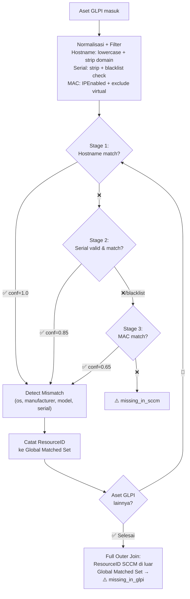
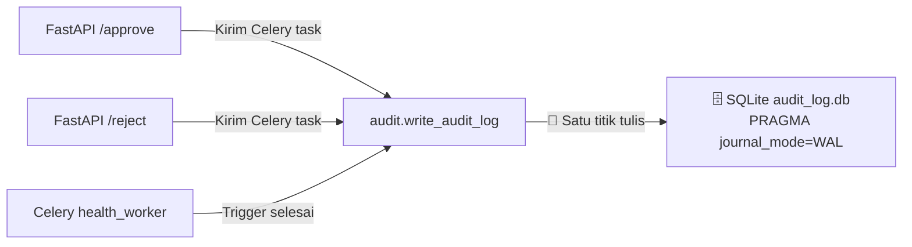

> **⛔ DOKUMEN INI TELAH DIPINDAHKAN**
>
> Dokumen PRD ini telah dipindahkan ke subdirektori `docs/planned/PRD/`.
>
> **Buka di:** `docs/planned/PRD/PRD-04-SCCM-Connector-Data-Layer.md`

---

# PRD-04: SCCM Connector & Data Layer

> **Modul:** AI Engine — SCCM SQL Server Connector + Data Normalization + GLPI-SCCM Correlation  
> **Sprint:** 3-4  
> **Prioritas:** 🔴 High  
> **Dependensi:** PRD-01 (Docker), PRD-03 (GLPI DB Connector)  
> **PIC Pengembang:** Tim AI  
> **PIC AHM:** SCCM Admin + DBA (account provisioning, info konfirmasi)  
> **Repo:** `/home/ariel/projects/chatbot-fastapi/`
> 
> **📌 Dokumen Terkait:**
> - [`context.md`](../context.md) — ADR-01 s.d ADR-10, Daftar Prasyarat AHM, Sumber Data SCCM
> - [`plan.md`](../plan.md) — Task 1-7, Implementation Plan
> - [`spec.md`](../spec.md) — Spesifikasi teknis detail, Pydantic models, Endpoint reference

---

## 1. Deskripsi Modul

Modul ini mencakup **5 sub-komponen** (perubahan dari 3 di versi sebelumnya) sejalan dengan ADR di context.md:

1. 🔌 **SCCM Connector** — Koneksi read-only ke database SCCM (SQL Server) via SQLAlchemy + pymssql dengan Keyset Pagination dan TLS
2. 📦 **Data Normalization Layer** — Normalisasi data dari GLPI dan SCCM ke format `NormalizedAsset` + `AuditLogEntry`
3. 🔗 **Asset Correlator** — Multi-Stage Fallback Matching (Hostname → Serial → MAC) dengan Data Quality Filters
4. ⚙️ **Celery Background Worker** — Korelasi massal via `health.correlate_glpi_sccm` + Audit Writer Celery task
5. 👮 **Approval Gate & Audit Trail** — Human review workflow dengan status `pending_review` → `approved`/`rejected`, SQLite WAL audit store

---

## 2. Tujuan & Kriteria Sukses

### 2.1 Tujuan

1. Membuat SQLAlchemy-based connector ke SCCM SQL Server (read-only) dengan Keyset Pagination dan TLS
2. Menyediakan 8 query methods untuk data SCCM
3. Membuat normalizer GLPI ↔ SCCM ke `NormalizedAsset` dan `AuditLogEntry`
4. Membuat correlator Multi-Stage Fallback: Hostname (conf 1.0) → Serial (conf 0.85) → MAC (conf 0.65) + Full-Outer-Join logic
5. Membuat 4 CrewAI tools untuk SCCM Agent
6. Celery background task untuk korelasi + guard duplicate job idempotency
7. Approval gate endpoint dengan idempotency guard
8. SQLite persistent audit trail (WAL mode)

### 2.2 Kriteria Sukses (Acceptance Criteria)

| ID | Kriteria | Verifikasi |
|----|----------|------------|
| AC-01 | SCCM Connector koneksi ke SQL Server dengan TLS + keyset pagination | Connection test + batch fetch |
| AC-02 | Semua 8 query methods return data benar | Unit test |
| AC-03 | Normalizer GLPI + SCCM → `NormalizedAsset` | Unit test |
| AC-04 | Normalizer → `AuditLogEntry` (requester_id/name, action, timestamp) | Unit test |
| AC-05 | Correlator Stage 1: match by hostname dengan confidence 1.0 | Test with exact match |
| AC-06 | Correlator Stage 2: match by serial dengan confidence 0.85 | Test with serial match |
| AC-07 | Correlator Stage 3: match by MAC dengan confidence 0.65 | Test with MAC match |
| AC-08 | Correlator skip serial placeholder (blacklist) → lanjut Stage 3 | Test with "To Be Filled By O.E.M." |
| AC-09 | Correlator skip MAC virtual adapter → tidak false match | Test with vEthernet adapter |
| AC-10 | Correlator stale records resolver: pilih LastHWScan terbaru | Test with duplicate ResourceID |
| AC-11 | Full-Outer-Join: aset GLPI gagal 3 stage → `missing_in_sccm` | Test |
| AC-12 | Full-Outer-Join: aset SCCM unmatched → `missing_in_glpi` | Test |
| AC-13 | SCCM tools (4 tools) berfungsi di CrewAI agent | Chat test |
| AC-14 | POST `/v1/health/correlate` trigger Celery + guard duplicate job → 409 Conflict | cURL test |
| AC-15 | POST `/v1/health/correlate/{id}/approve` dengan idempotency → 409 jika sudah approved | cURL test |
| AC-16 | Audit trail tercatat di SQLite (`audit_log.db`) dengan WAL mode | File check |
| AC-17 | Autentikasi: `/v1/health/*` pakai `GLPI_PLUGIN_API_KEY` (bukan `GATEWAY_API_KEY`) | Test wrong key → 401 |
| AC-18 | Semua operasi SCCM bersifat read-only | Code review |

---

## 3. Spesifikasi Teknis

### 3.1 🔌 Sub-Modul A: SCCM Connector

#### File Baru

| File | Fungsi |
|------|--------|
| `app/connectors/__init__.py` | Module init |
| `app/connectors/sccm_connector.py` | Class `SCCMConnector` — 8 query methods + Keyset Pagination |

#### Config Settings (`app/config.py`)

```python
sccm_db_host: str = ""
sccm_db_port: int = 1433
sccm_db_name: str = "CM_PS1"
sccm_db_user: str = ""
sccm_db_password: str = ""
sccm_db_encrypt: bool = True              # 🔒 TLS wajib
sccm_db_trust_server_cert: bool = True    # ⚙️ False = CA-signed cert
```

#### Connection Parameters (ADR-02, ADR-04)

| Parameter | Nilai | Alasan |
|-----------|-------|--------|
| Driver | `mssql+pymssql://` | SQLAlchemy + FreeTDS |
| Pool | `QueuePool` | Connection pooling bawaan |
| `pool_size` | `3` | Minimal untuk 1 concurrent job |
| `max_overflow` | `5` | Peak burst handling |
| `pool_pre_ping` | `True` | Auto-detect broken connection |
| `pool_recycle` | `3600` | 1 jam maks koneksi idle |
| `encrypt` | `true` | Enkripsi TLS data transit |
| `trustServerCertificate` | dinamis | Self-signed/CA support |

#### Query Methods

| Method | Signature | Return | SQL View | Pagination |
|--------|-----------|--------|----------|------------|
| `test_connection` | `() -> dict` | `{"status":"ok","version":"..."}` | `SELECT @@VERSION` | — |
| `get_all_systems` | `(last_seen_id: int, batch_size: int) -> list[dict]` | List sistem aktif | `v_R_System` | 🔑 **Keyset** (`ResourceID > :last_id`) |
| `find_by_hostname` | `(hostname: str) -> dict \| None` | Single system | `v_R_System` | — |
| `find_by_serial` | `(serial: str) -> dict \| None` | Single system | `v_GS_PC_BIOS` join `v_R_System` | — |
| `find_by_mac` | `(mac: str) -> dict \| None` | Single system | `v_GS_NETWORK_ADAPTER` join `v_R_System` | — |
| `get_computer_hardware` | `(resource_id: int) -> dict \| None` | CPU, RAM, OS, Manufaktur | 4 views join | — |
| `get_software_inventory` | `(resource_id: int) -> list[dict]` | Installed software | `v_GS_INSTALLED_SOFTWARE_CATEGORIZED` | — |
| `get_patch_compliance` | `(resource_id: int) -> dict` | Compliance metrics | `v_Update_ComplianceStatus` | — |

#### 🔑 Keyset Pagination — Detail

**Mengapa:** Limit-Offset pada dataset besar (>20.000 baris) menyebabkan SQL Server harus scan seluruh baris sebelum offset. Keyset pagination lebih stabil performanya.

```python
def get_all_systems(self, last_seen_id: int = 0, batch_size: int = 1000) -> list[dict]:
    """Fetch SCCM systems using keyset pagination."""
    return self.execute_query("""
        SELECT sys.ResourceID, sys.Name0 AS hostname, ...
        FROM v_R_System sys
        WHERE sys.Obsolete0 = 0
          AND sys.Active0 = 1
          AND sys.ResourceID > :last_seen_id
        ORDER BY sys.ResourceID
        OFFSET 0 ROWS FETCH NEXT :batch_size ROWS ONLY
    """, {"last_seen_id": last_seen_id, "batch_size": batch_size})
```

#### 💡 Catatan Implementasi

- `find_by_serial()` menggunakan `v_GS_PC_BIOS` yang **tidak ada** di PRD-04 versi lama — perlu dikonfirmasi dengan SCCM Admin AHM
- `get_all_systems` default filter: `sys.Obsolete0 = 0 AND sys.Active0 = 1`

---

### 3.2 📦 Sub-Modul B: Data Normalization Layer

#### File Baru

| File | Fungsi |
|------|--------|
| `app/normalizers/__init__.py` | Module init |
| `app/normalizers/asset_mapper.py` | Pydantic models: `NormalizedAsset`, `AssetMappingResult` |
| `app/normalizers/audit.py` | Pydantic model: `AuditLogEntry` |
| `app/normalizers/glpi_normalizer.py` | `normalize_glpi_computer()` |
| `app/normalizers/sccm_normalizer.py` | `normalize_sccm_system()` |

#### Pydantic Models

```python
# app/normalizers/asset_mapper.py
from pydantic import BaseModel

class NormalizedAsset(BaseModel):
    source: str                             # "glpi" | "sccm" | "both"
    hostname: str = ""
    serial_number: str = ""
    mac_addresses: list[str] = []
    manufacturer: str = ""
    model: str = ""
    os_name: str = ""
    os_version: str = ""
    ip_address: str = ""
    location: str = ""
    user_name: str = ""
    status: str = ""
    last_seen: str = ""
    glpi_id: int | None = None
    sccm_resource_id: int | None = None


class AssetMappingResult(BaseModel):
    glpi_asset: NormalizedAsset | None = None
    sccm_asset: NormalizedAsset | None = None
    match_status: str = "unmatched"         # matched | mismatch | missing_in_sccm | missing_in_glpi
    mismatches: list[dict] = []             # [{"field": "...", "glpi": "...", "sccm": "..."}]
    match_method: str = ""                  # hostname | serial | mac
    match_confidence: float = 0.0           # 1.0 | 0.85 | 0.65 (see §3.3)
    review_status: str = "pending_review"   # pending_review | approved | rejected
```

```python
# app/normalizers/audit.py
from pydantic import BaseModel, Field
from datetime import datetime

class AuditLogEntry(BaseModel):
    job_id: str
    requester_id: str
    requester_name: str
    action: str                              # trigger | approve | reject
    timestamp: datetime = Field(default_factory=datetime.utcnow)
    summary_changes: dict = {}
```

---

### 3.3 🔗 Sub-Modul C: Asset Correlator

#### File Baru

| File | Fungsi |
|------|--------|
| `app/correlators/__init__.py` | Module init |
| `app/correlators/asset_correlator.py` | Class `AssetCorrelator` — matching, data quality, full-outer-join |

#### Confidence by Match Method (ADR-04)

| Match Method | Confidence | Basis |
|---|---|---|
| 🏠 **Hostname** | `1.0` | Full match setelah normalisasi (lowercase, strip domain suffix `.corp.local`) |
| 🔢 **Serial** | `0.85` | Kuat, tapi tetap ada risiko placeholder walau sudah difilter |
| 🌐 **MAC** | `0.65` | Rentan false positive karena NIC bisa dipindah antar device |

#### Algoritma Multi-Stage Fallback



#### Data Quality Filters

| Filter | Penerapan | Pattern |
|--------|-----------|---------|
| **Serial Blacklist** | Stage 2 skip jika serial ada di daftar | `"To Be Filled By O.E.M."`, `"System Serial Number"`, `"00000000"`, `"12345678"`, `"Not Specified"` (case-insensitive) |
| **MAC Exclude Virtual** | Stage 3 skip adapter non-fisik | `Description0 NOT LIKE '%Virtual%' AND NOT LIKE '%VPN%' AND NOT LIKE '%TAP%' AND NOT LIKE '%Bluetooth%'` |
| **MAC Filter IP** | Hanya adapter aktif | `IPEnabled0 = 1` |
| **Stale Resolver** | Multi-match → pilih terbaru | `ORDER BY LastHWScan DESC LIMIT 1` |
| **Aset Aktif** | Default filter semua query | `Obsolete0 = 0 AND Active0 = 1` |

#### Full-Outer-Join: Missing Asset Detection (ADR-04)

```
1. Iterasi semua aset GLPI:
   - Stage 1 → 3 cari match di SCCM
   - Jika match → catat ResourceID SCCM ke "Global Matched Set"
   - Jika gagal → match_status = "missing_in_sccm"

2. Setelah iterasi GLPI selesai:
   - Query SEMUA ResourceID SCCM (dari v_R_System, paginated)
   - ResourceID yang TIDAK ada di Global Matched Set
     → match_status = "missing_in_glpi"
```

---

### 3.4 ⚙️ Sub-Modul D: Celery Worker & Audit Store

#### File Baru

| File | Fungsi |
|------|--------|
| `app/workers/celery_app.py` | Celery app init (Redis broker) |
| `app/workers/health_worker.py` | Task `health.correlate_glpi_sccm` |
| `app/workers/audit_worker.py` | Task `audit.write_audit_log` |

#### Storage Strategy (ADR-08, ADR-10)

| Store | Tujuan | Persistence | TTL |
|-------|--------|-------------|-----|
| 🟢 **Redis** | Job progress + pending review | Volume mount (`appendonly yes`) | `pending_review` = **tanpa TTL** |
| 🟢 **Redis** | Approved/rejected results | Volume mount | TTL 30 hari setelah aksi |
| 🟤 **SQLite** | Audit trail log | Volume mount `./data/audit` | **Permanent** (backup AHM via VM snapshot) |

#### Guard & Idempotency (ADR-08)

| Guard | Trigger | Response |
|-------|---------|----------|
| 🚫 **Duplicate Job** | `POST /correlate` saat ada `job:running` | `409 Conflict` + `{"existing_job_id": "..."}` |
| 🔒 **Idempotency Approve** | `POST /approve` pada job bukan `pending_review` | `409 Conflict` + `{"error": "Job already approved/rejected"}` |
| 🔒 **Idempotency Reject** | `POST /reject` pada job bukan `pending_review` | `409 Conflict` |

#### Audit Write Strategy (ADR-10)



---

### 3.5 🖥️ Sub-Modul E: API Endpoints

#### Autentikasi Dua Jalur (ADR-09)

| Endpoint Group | API Key | Scope |
|---|---|---|
| 💬 Chat (`/v1/chat/*`) | `GATEWAY_API_KEY` | Chat dengan AI (existing) |
| 🩺 Korelasi (`/v1/health/*`) | `GLPI_PLUGIN_API_KEY` | 🔐 **Khusus GLPI plugin (baru)** |

| Endpoint | Method | Deskripsi | Guard |
|----------|--------|-----------|-------|
| `/health` | GET | Status sistem + SCCM DB | Public |
| `/v1/health/correlate` | POST | Trigger background korelasi | 🚫 Duplicate job → 409 |
| `/v1/health/correlate/pending` | GET | List job `pending_review` | — |
| `/v1/health/correlate/{job_id}` | GET | Detail hasil korelasi | — |
| `/v1/health/correlate/{job_id}/approve` | POST | Approve hasil | 🔒 Idempotency → 409 |
| `/v1/health/correlate/{job_id}/reject` | POST | Reject hasil | 🔒 Idempotency → 409 |

**Identity Headers:** Approval/Reject wajib menyertakan header `X-Requester-ID` dan `X-Requester-Name` untuk audit trail.

---

### 3.6 🤖 Sub-Modul F: SCCM CrewAI Tools

#### File Baru

| File | Fungsi |
|------|--------|
| `app/tools/sccm_tools.py` | 4 CrewAI tools |
| `app/agents/sccm_agent.py` | SCCM Infrastructure Specialist Agent |

#### Tools & Multi-Agent (ADR-05, ADR-06)

| Tool Name | Fungsi | Agent Owner |
|-----------|--------|-------------|
| `get_sccm_computer_detail` | Hardware specs + OS detail | 🖥️ SCCM Specialist |
| `get_sccm_software_inventory` | Software terinstall | 🖥️ SCCM Specialist |
| `get_sccm_patch_status` | Patch compliance metrics | 🖥️ SCCM Specialist |
| `compare_glpi_sccm` | Perbandingan data GLPI vs SCCM | 🎯 **Joint Crew** |

#### Intent Routing (ADR-06)

| Intent | Agent | Contoh Query |
|--------|-------|-------------|
| 💬 `casual` | Tidak ada (langsung) | "Halo, apa kabar?" |
| 📋 `glpi_support` | 👤 GLPI Agent | "Tiket saya yang masih open?" |
| 🖥️ `sccm_tech` | 🖥️ SCCM Agent | "Software terinstall di PC-001?" |
| 🔗 `joint_analysis` | 🎯 **Joint Crew** (GLPI + SCCM + Orchestrator) | "Bandingkan data PC-001 di GLPI dan SCCM" |

---

## 4. Perubahan dari Versi Sebelumnya

Berikut daftar perubahan signifikan PRD-04 vs versi lama:

| Area | Versi Lama | Versi Baru | Alasan |
|------|-----------|------------|--------|
| **Pagination** | Limit-Offset (`get_all_systems()` full fetch) | 🔑 **Keyset** (`ResourceID > :last_id`) | Performa stabil di dataset besar |
| **Data Quality** | Tidak ada | ✅ Serial blacklist, MAC exclude virtual, Stale Resolver, filter Active/Obsolete | Akurasi matching nyata di lapangan |
| **Confidence** | Hardcoded `0.9` / `0.7` / `0.8` | ✅ `1.0` (hostname) / `0.85` (serial) / `0.65` (mac) | Transparan & traceable |
| **Matching** | Hostname-only | ✅ **Multi-Stage Fallback** (Hostname → Serial → MAC) | Menangani rename domain/serial mismatch |
| **Full-Outer-Join** | Hanya deteksi missing_in_sccm | ✅ Two-way: `missing_in_sccm` + `missing_in_glpi` | Shadow IT detection |
| **Approval Gate** | Tidak ada | ✅ `pending_review` → `approved`/`rejected` + idempotency guard | Governance compliance §5.2.1.2.1 |
| **Audit Trail** | Tidak ada | ✅ SQLite persistent (WAL mode) + Celery audit task | Kepatuhan audit §5.1(a) |
| **Auth** | 1 API key (`GATEWAY_API_KEY`) | ✅ **2 keys**: Chat vs Korelasi (`GLPI_PLUGIN_API_KEY`) | Trust boundary ADR-09 |
| **Multi-Agent** | 1 agent (IT Support) | ✅ **3 agents** (GLPI + SCCM + Orchestrator Manager) + **4-category intent routing** | Effisiensi token + akurasi jawaban |
| **Celery Guard** | Tidak ada | ✅ Duplicate job guard → 409 Conflict | Prevent overload |
| **TLS Config** | Tidak disebut | ✅ `encrypt=true` + `trustServerCertificate` dinamis | Security compliance |
| **Docker Volume** | Redis saja | ✅ Redis + SQLite (`./data/audit`) | Data persistence audit |

---

## 5. Perubahan pada File yang Ada

### 5.1 `app/config.py` — Tambahan Field SCCM + Auth

```python
# ── SCCM Database ───────────────────────────────────────────────
sccm_db_host: str = ""
sccm_db_port: int = 1433
sccm_db_name: str = "CM_PS1"
sccm_db_user: str = ""
sccm_db_password: str = ""
sccm_db_encrypt: bool = True
sccm_db_trust_server_cert: bool = True

# ── Celery & Redis ──────────────────────────────────────────────
redis_url: str = "redis://localhost:6379/0"

# ── GLPI Plugin Auth ────────────────────────────────────────────
glpi_plugin_api_key: str = ""    # 🔐 Pemisahan dari GATEWAY_API_KEY
```

### 5.2 `app/main.py` — Lifecycle Init

```python
from app.connectors.sccm_connector import init_sccm_db, close_sccm_db

@asynccontextmanager
async def lifespan(app: FastAPI):
    # Startup
    if settings.sccm_db_host:
        init_sccm_db(settings)
        logger.info("SCCM DB init (graceful fallback if offline)")
    yield
    # Shutdown
    close_sccm_db()
```

### 5.3 `app/api/auth.py` — Dual Auth Middleware

```python
from fastapi import Header, HTTPException
from app.config import settings

def verify_gateway_key(authorization: str | None = Header(None)):
    """Auth for chat endpoints."""
    if authorization != f"Bearer {settings.gateway_api_key}":
        raise HTTPException(status_code=401, detail="Unauthorized")

def verify_plugin_key(authorization: str | None = Header(None)):
    """Auth for correlation management endpoints."""
    if authorization != f"Bearer {settings.glpi_plugin_api_key}":
        raise HTTPException(status_code=401, detail="Unauthorized")
```

### 5.4 `.env.example` — Variabel Baru

```bash
# SCCM Database
SCCM_DB_HOST=10.0.0.50
SCCM_DB_PORT=1433
SCCM_DB_NAME=CM_PS1
SCCM_DB_USER=sccm_readonly
SCCM_DB_PASSWORD=
SCCM_DB_ENCRYPT=true
SCCM_DB_TRUST_SERVER_CERT=true

# Celery & Redis
REDIS_URL=redis://redis:6379/0

# GLPI Plugin Auth
GLPI_PLUGIN_API_KEY=sk-glpi-plugin-xxx
```

---

## 6. Error Handling (Update dari Versi Lama)

| Error Baru | Penyebab | Handling |
|------------|----------|----------|
| `sqlite3.OperationalError` | SQLite audit write failure | Retry via Celery, log warning, don't crash |
| `pymssql.OperationalError` (StatementTimeout) | Query terlalu lama akibat keyset besar | `pool_pre_ping=True`, timeout per query |
| DuplicateJobError | Guard duplicate → 409 Conflict | Return existing_job_id |
| IdempotencyError | Approve/reject duplikat → 409 Conflict | Return error + current status |

---

## 7. Risiko & Mitigasi (Update)

| Risiko Baru | Prob. | Impact | Mitigasi |
|-------------|-------|--------|----------|
| FreeTDS build failure di Docker (pymssql C extension) | Rendah | Tinggi | Pre-built wheel `pymssql==2.3.0` + install `freetds-dev` di Dockerfile.worker |
| SQLite multi-worker lock | Sedang | Sedang | WAL mode + Celery audit task sentral + single-worker recommendation |
| Serial number placeholder false match | Sedang | Sedang | Blacklist filtering Stage 2 + skip ke MAC |
| Hostname tidak konsisten (FQDN vs NetBIOS) | Sedang | Sedang | Normalisasi: lowercase + strip domain `\.\w+$` |

---

## 8. Dependensi & Timeline

```mermaid
gantt
    title Timeline PRD-04 vs PRD Terkait
    dateFormat  YYYY-MM-DD
    axisFormat  %d-%b
    
    section 🔌 SCCM Connector
    Task 1: Setup + Config      :t1, 2026-07-28, 2d
    Task 2: Normalization       :t2, after t1, 2d
    Task 3: Connector class     :t3, after t2, 3d
    Task 4: Correlator          :t4, after t2, 3d
    Task 5: Celery + API        :t5, after t3, 4d
    Task 6: CrewAI Agents       :t6, after t4, 3d
    Task 7: E2E Testing         :t7, after t5, after t6, 2d
    
    section 📋 PRD Terkait
    PRD-01: Docker infra        :p1, 2026-07-21, 5d
    PRD-03: GLPI DB Connector   :p3, 2026-07-21, 5d
    PRD-05: Asset Health AI     :p5, after t5, 5d
```

---

## 9. Deliverables

| Deliverable | Lokasi | Status |
|-------------|--------|--------|
| SCCM Connector class | `app/connectors/sccm_connector.py` | 🆕 Create |
| Asset Mapper models | `app/normalizers/asset_mapper.py` | 🆕 Create |
| Audit model | `app/normalizers/audit.py` | 🆕 Create |
| GLPI Normalizer | `app/normalizers/glpi_normalizer.py` | 🆕 Create |
| SCCM Normalizer | `app/normalizers/sccm_normalizer.py` | 🆕 Create |
| Asset Correlator | `app/correlators/asset_correlator.py` | 🆕 Create |
| Celery app init | `app/workers/celery_app.py` | 🆕 Create |
| Correlation Celery task | `app/workers/health_worker.py` | 🆕 Create |
| Audit Celery task | `app/workers/audit_worker.py` | 🆕 Create |
| Health API router | `app/api/routes/health.py` | 🆕 Create |
| Dual auth middleware | `app/api/auth.py` | 🆕 Create |
| SCCM CrewAI tools | `app/tools/sccm_tools.py` | 🆕 Create |
| SCCM Agent | `app/agents/sccm_agent.py` | 🆕 Create |
| Config update | `app/config.py` | ✏️ Extend |
| Lifecycle init | `app/main.py` | ✏️ Extend |
| Docker volume + deps | `docker-compose.yml` | ✏️ Update |
| Unit tests | `tests/test_sccm_connector.py`, `tests/test_asset_correlator.py`, `tests/test_sccm_tools.py` | 🆕 Create |
| E2E test | `tests/test_e2e_correlation.py` | 🆕 Create |

---

> **📌 Dokumen ini selaras dengan:**  
> - ADR-01 s.d ADR-10 di [`context.md`](../context.md)  
> - Task 1-7 di [`plan.md`](../plan.md)  
> - Spesifikasi detail di [`spec.md`](../spec.md)  
> - PRD-01 (Docker infra: volume, FreeTDS deps)  
> - PRD-05 (Asset Health: SCCM data sebagai input scoring)
