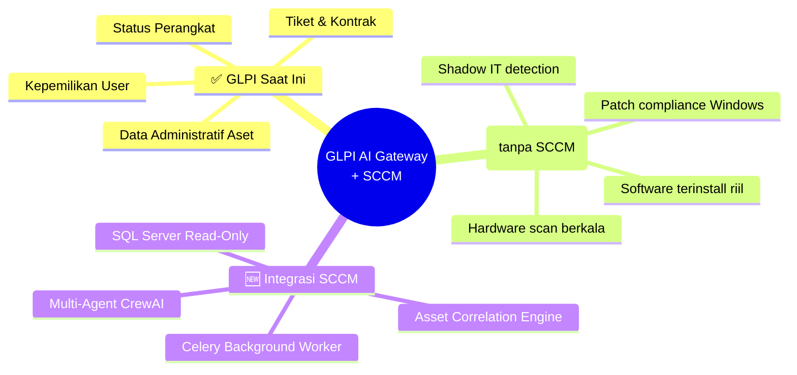
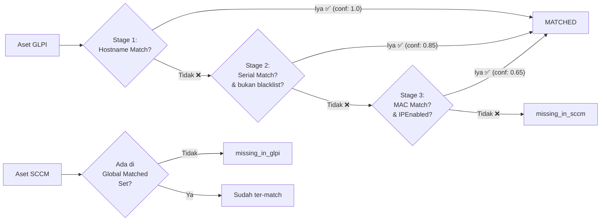
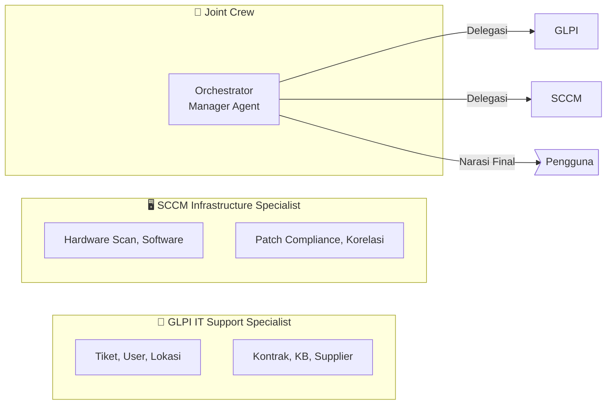
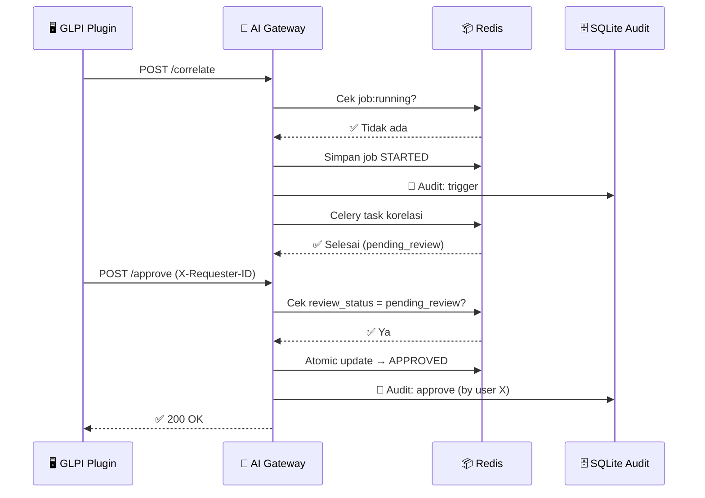
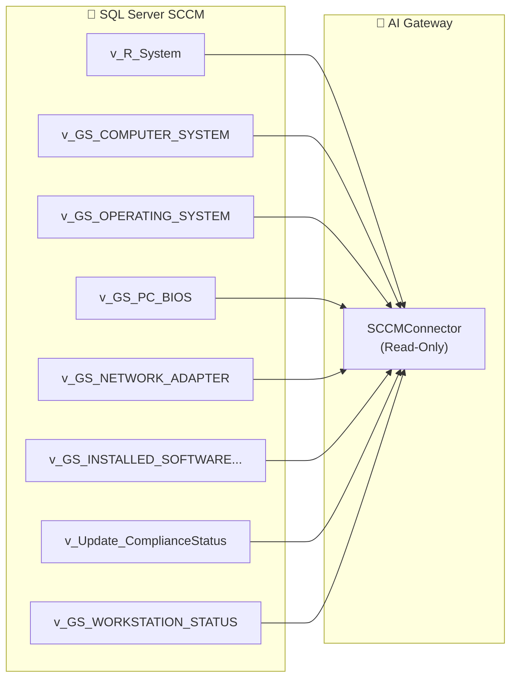

# 📋 CONTEXT.md — Konteks & Latar Belakang Integrasi SCCM

> **🗺️ Peta Navigasi:**  
> [🎯 Problem Statement](#1-ringkasan-proyek--problem-statement) · [🏗️ ADR Log](#2-arsitektur--keputusan-desain-adr-log) · [🗃️ Sumber Data](#3-sumber-data--pemetaan-sql-server-sccm) · [🔗 Dependencies](#4-prasyarat-eksternal--open-questions-ahm)

---

## 1. 🎯 Ringkasan Proyek & Problem Statement

**GLPI AI Gateway** adalah backend berbasis FastAPI + CrewAI + LiteLLM yang berfungsi sebagai jembatan cerdas antara antarmuka chat dan sistem IT Asset Management (GLPI).

Saat ini, GLPI menyimpan **data administratif** aset (kepemilikan user, status perangkat, lokasi, nomor kontrak, tiket bantuan). Namun, GLPI **tidak memiliki** data telemetri teknis real-time:

| 🚩 Kesenjangan | Dampak |
|---|---|
| 🔍 Software terinstall di endpoint | Tidak bisa menjawab *"Aplikasi apa saja terpasang di PC-001?"* |
| 🛡️ Patch compliance Windows | Tidak bisa menjawab *"Apakah PC-001 sudah fully patched?"* |
| 🖥️ Spesifikasi hardware aktual | Data spek bisa basi (tidak update hasil scan) |
| 👻 Shadow IT detection | Perangkat aktif di jaringan tapi tidak tercatat di GLPI (atau sebaliknya) |

> **💡 Solusi:** Sistem diintegrasikan dengan **Microsoft System Center Configuration Manager (SCCM)** (versi 2012 atau Current Branch — *tergantung konfirmasi AHM*) melalui database SQL Server miliknya secara **read-only**.

---

## 2. 🏗️ Arsitektur & Keputusan Desain (ADR Log)

```mermaid
graph TB
    subgraph "📊 Ringkasan 10 ADR"
        A1["ADR-01: Lokus Python FastAPI ✅"] --> A2["ADR-02: SQLAlchemy + pymssql ✅"]
        A2 --> A3["ADR-03: Celery + Redis ✅"]
        A3 --> A4["ADR-04: Multi-Stage Matching ✅"]
        A4 --> A5["ADR-05: Multi-Agent CrewAI ✅"]
        A5 --> A6["ADR-06: Intent Routing 4 Kategori ✅"]
        A6 --> A7["ADR-07: Graceful Degradation ✅"]
        A7 --> A8["ADR-08: Approval Gate + Idempotency ✅"]
        A8 --> A9["ADR-09: Audit Trail + Trust Boundary ✅"]
        A9 --> A10["ADR-10: SQLite WAL Persistent ✅"]
    end
```

<strong>📖 Cara Membaca Tabel ADR</strong>

| Simbol | Arti |
|---|---|
| 🟢 **Keputusan** | Pilihan arsitektur yang diambil |
| 💡 **Rasional** | Alasan mengapa pilihan ini diambil |
| ⚠️ **Known Limitation** | Risiko yang disadari dan diterima untuk MVP |

---

### ADR-01: 🏠 Lokus Implementasi pada Python FastAPI Gateway

| Aspek | Detail |
|---|---|
| 🟢 **Keputusan** | Seluruh konektor DB, normalisasi, korelasi, dan tool AI dibangun di repo `chatbot-fastapi` |
| 💡 **Rasional** | Mencegah extension `pdo_sqlsrv` di server GLPI PHP. Plugin tetap ringan & komunikasi via REST API |
| 📍 **Dampak File** | `app/connectors/`, `app/correlators/`, `app/tools/sccm_tools.py` |

---

### ADR-02: 🔌 Koneksi Database via SQLAlchemy Sync + pymssql + TLS

| Aspek | Detail |
|---|---|
| 🟢 **Keputusan** | SQLAlchemy Engine + `pymssql` + `QueuePool` + `pool_pre_ping=True` |
| 🔒 **TLS** | `encrypt=true` + flag dinamis `sccm_db_trust_server_cert` (self-signed cert support) |
| 💡 **Rasional** | Thread-safe, auto-detect connection loss, kompatibel dengan sync CrewAI tools & async FastAPI via `asyncio.to_thread` |

---

### ADR-03: ⚙️ Asynchronous Correlation Worker (Celery + Redis)

| Aspek | Detail |
|---|---|
| 🟢 **Keputusan** | `celery` + `redis` sebagai message broker & background worker |
| 💡 **Rasional** | Korelasi ribuan aset butuh waktu puluhan detik hingga menit — tidak boleh memblokir chat endpoint |
| 🐳 **Deployment** | Service Redis + Celery worker di `docker-compose.yml` |

---

### ADR-04: 🔗 Multi-Stage Fallback Matching Hierarchy

| 🟢 **Confidence Table** | Nilai |
|---|---|
| Hostname (full match + normalisasi) | `1.0` |
| Serial Number (valid & bukan placeholder) | `0.85` |
| MAC Address (IP-enabled & non-virtual) | `0.65` |

| 🧹 **Data Quality Filters** | Detail |
|---|---|
| Serial Blacklist | `"To Be Filled By O.E.M."`, `"System Serial Number"`, `"00000000"`, `"12345678"`, `"Not Specified"` |
| MAC Filter | Hanya adapter dengan `IPEnabled0=1` + exlude `%Virtual%`, `%VPN%`, `%TAP%`, `%Bluetooth%` |
| Stale Resolver | Jika multiple ResourceID → pilih dengan `LastHWScan` terbaru |
| Aset Aktif | Default filter `Obsolete0=0 AND Active0=1` |

---

### ADR-05: 🤖 Multi-Agent CrewAI (IT Support + SCCM Specialist)

---

### ADR-06: 🧭 Intent-Based Dynamic Routing (4 Kategori)

| Kategori Intent | Contoh Query | Agent yang Dipanggil |
|---|---|---|
| 💬 `casual` | *"Halo, apa kabar?"* | ❌ Tidak ada (respons langsung) |
| 📋 `glpi_support` | *"Tiket saya yang masih open?"* | ✅ GLPI Agent saja |
| 🖥️ `sccm_tech` | *"Software terinstall di PC-001?"* | ✅ SCCM Agent saja |
| 🔗 `joint_analysis` | *"Bandingkan data PC-001 di GLPI dan SCCM"* | ✅ Joint Crew (GLPI + SCCM + Orchestrator) |

---

### ADR-07: 🛡️ Graceful Degradation & Soft Fallback

> **🔥 Golden Rule:** SCCM *down* ≠ chatbot *down*

| Skenario | Perilaku Sistem |
|---|---|
| 🔌 SCCM tidak dikonfigurasi | ✅ FastAPI tetap jalan, `/health` → `sccm_db: "unconfigured"` |
| 💥 SCCM connection fail | ✅ Tool SCCM return fallback message tanpa crash |
| 💬 Chat GLPI murni | ✅ Tidak terpengaruh sama sekali |

---

### ADR-08: 👮 Human Review & Approval Gate

| Fitur Governance | Mekanisme |
|---|---|
| 🛑 **Duplicate Job Guard** | Cek `job:running` di Redis → HTTP **409 Conflict** jika masih ada job berjalan |
| 🔒 **Idempotency Approve/Reject** | Atomic guard: hanya bekerja jika `review_status == 'pending_review'` → **409 Conflict** jika sudah diproses |
| 👤 **Identitas Approver** | Header `X-Requester-ID` & `X-Requester-Name` dari GLPI plugin |

---

### ADR-09: 📝 Audit Trail Logging & Trust Boundary

| Aspek | Detail |
|---|---|
| 🟢 **Keputusan** | Audit log ke **SQLite** (WAL mode) + **API key khusus** `GLPI_PLUGIN_API_KEY` |
| 🔑 **Auth Separation** | Chat → `GATEWAY_API_KEY` · Korelasi → `GLPI_PLUGIN_API_KEY` |
| 📤 **Write Strategy** | Semua audit write via **Celery task** `audit.write_audit_log` (satu titik tulis) |
| ⚠️ **Accepted Risk (MVP)** | Jika `GLPI_PLUGIN_API_KEY` bocor, identitas approver bisa dipalsukan. Non-repudiation penuh → validasi balik GLPI REST API (post-MVP) |

<strong>📋 Struktur Audit Log Entry</strong>

| Field | Contoh |
|---|---|
| `job_id` | `"corr-abc123"` |
| `requester_id` | `"42"` |
| `requester_name` | `"Budi.IT"` |
| `action` | `"approve"` / `"reject"` / `"trigger"` |
| `timestamp` | `"2026-07-22T10:30:00Z"` |
| `summary_changes` | `{"matched": 150, "mismatch": 12, "missing_in_sccm": 3}` |

---

### ADR-10: 🗄️ SQLite Persistent Store untuk Audit Log

| Aspek | Detail |
|---|---|
| 🟢 **Keputusan** | SQLite lokal dengan `PRAGMA journal_mode=WAL` |
| 💾 **Volume** | `./data/audit:/app/data/audit` (persistent mount) |
| 📦 **Lokasi File** | `/app/data/audit/audit_log.db` |
| 🔄 **Backup** | Tanggung jawab AHM via backup VM-level / disk snapshot |

---

## 3. 🗃️ Sumber Data & Pemetaan SQL Server SCCM

> Database SCCM (biasanya bernama `CM_<SITE_CODE>`, contoh `CM_PS1`) diakses secara **READ-ONLY**.

| View | 🔑 Kolom Kunci | 🎯 Tujuan |
|---|---|---|
| `v_R_System` | `ResourceID`, `Name0`, `Active0`, `Obsolete0` | 🏠 Daftar sistem + hostname + filter aktif |
| `v_GS_COMPUTER_SYSTEM` | `ResourceID`, `Manufacturer0`, `Model0`, `UserName0` | 🖥️ Manufaktur, model, user logon |
| `v_GS_OPERATING_SYSTEM` | `ResourceID`, `Caption0`, `Version0`, `LastBootUpTime0` | 💿 Detail OS + uptime |
| `v_GS_NETWORK_ADAPTER` | `ResourceID`, `MACAddress0`, `IPAddress0`, `IPEnabled0`, `Description0` | 🌐 MAC matching (filter IP-enabled) |
| `v_GS_PC_BIOS` | `ResourceID`, `SerialNumber0` | 🔢 Serial number BIOS (secondary match) |
| `v_GS_INSTALLED_SOFTWARE_CATEGORIZED` | `ResourceID`, `DisplayName0`, `Version0`, `Publisher0` | 📦 Software inventory |
| `v_Update_ComplianceStatus` | `ResourceID`, `Status` (3=Installed, 2=Missing) | 🛡️ Patch compliance metric |
| `v_GS_WORKSTATION_STATUS` | `ResourceID`, `LastHWScan`, `LastSWScan` | ⏱️ Last heartbeat scan (stale resolver) |
| `v_GS_PROCESSOR` | `ResourceID`, `Name0`, `NumberOfCores0` | ⚡ CPU spec |
| `v_GS_X86_COMPUTER_SYSTEM` | `ResourceID`, `TotalPhysicalMemory0` | 💾 Total RAM |

---

## 4. 🔗 Prasyarat Eksternal & Open Questions (AHM Dependencies)

### 📋 Checklist Prasyarat (AHM Infrastructure)

| # | Item | Pihak | Status |
|---|---|---|---|
| 1 | 🔓 Firewall port 1433 → VM AI Gateway | 🔧 AHM Infra | ⬜ Belum |
| 2 | 👤 Akun DB read-only (SELECT ke views SCCM) | 🔧 AHM DBA | ⬜ Belum |
| 3 | 🔒 Informasi enkripsi TLS SQL Server | 🔧 AHM Infra | ❓ Perlu konfirmasi |
| 4 | 📦 Redis instance (existing/provision baru) | 🔧 AHM Infra | ❓ Perlu konfirmasi |
| 5 | 🔑 `GLPI_PLUGIN_API_KEY` untuk endpoint korelasi | ⚙️ Tim Implementasi | ⬜ Belum |
| 6 | 💾 Backup `audit_log.db` (VM-level snapshot) | 🔧 AHM Infra | 📝 Catatan |

### ❓ Open Questions (Menunggu Konfirmasi AHM)

| # | Pertanyaan | Dampak Jika Tidak Dijawab |
|---|---|---|
| 1 | Versi SCCM & SQL Server aktual? | ⚠️ Kompatibilitas view & driver |
| 2 | Kapan kredensial read-only DB tersedia? | 🚫 Blocker Task 3 |
| 3 | Redis — shared atau provision baru? | ⚠️ Konfigurasi docker-compose |
| 4 | TLS wajib? Certificate CA atau self-signed? | ⚙️ Setting `trustServerCertificate` |
| 5 | Single-worker atau multi-worker deployment? | ⚠️ Strategi SQLite locking |

---

> **📌 Status Dokumen:** ✅ Final — Siap untuk implementasi (Rev. 3 — ACC)
