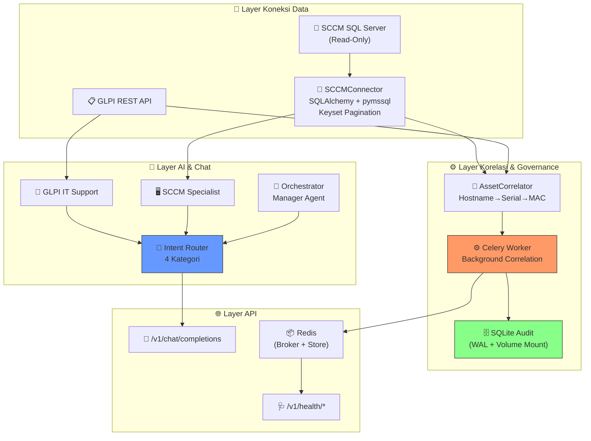
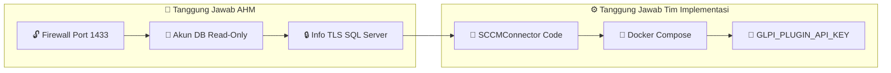
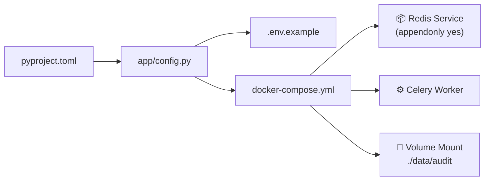
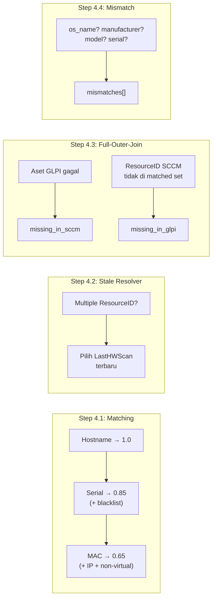
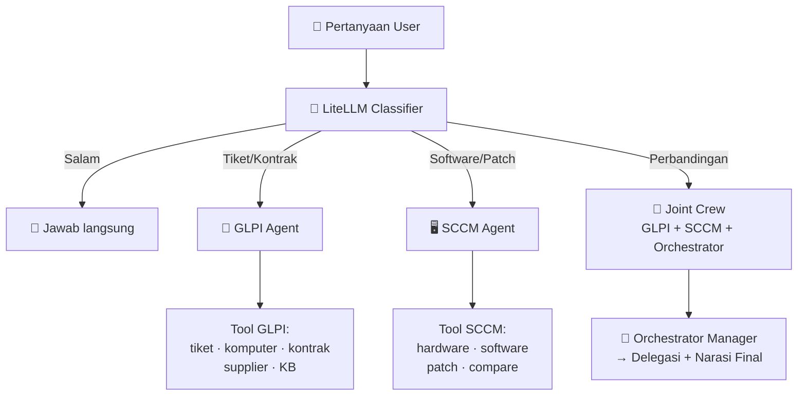
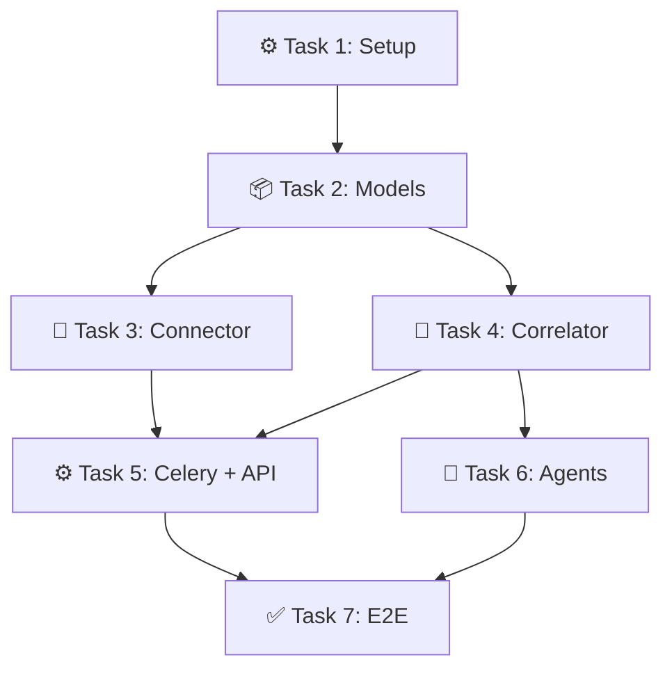

# 📋 PLAN.md — Rencana Implementasi Integrasi SCCM ke GLPI AI Gateway

> **For agentic workers:** REQUIRED SUB-SKILL: Use superpowers:subagent-driven-development (recommended) or superpowers:executing-plans to implement this plan task-by-task. Steps use checkbox (`- [ ]`) syntax for tracking.

> **🗺️ Peta Navigasi:**  
> [🎯 Goal & Scope](#goal--arsitektur) · [📋 Checklist Prasyarat](#prasyarat--dependency-eksternal) · [📦 Task 1: Setup](#task-1-dependencies-docker--settings) · [📦 Task 2: Models](#task-2-data-normalization--audit-models) · [📦 Task 3: Connector](#task-3-sccm-database-connector) · [📦 Task 4: Correlator](#task-4-multi-stage-fallback-asset-correlator) · [📦 Task 5: Workers](#task-5-celery-worker-sqlite-audit--api) · [📦 Task 6: Agents](#task-6-sccm-crewai-tools--orchestrator-joint-agent-routing) · [📦 Task 7: Verification](#task-7-end-to-end-verification--documentation)

---

## 🎯 Goal & Arsitektur

| Aspek | Detail |
|---|---|
| **🎯 Goal** | Integrasi database SCCM (SQL Server) → enrich AI dengan data hardware live, software inventory, patch compliance, asset correlation gap analysis |
| **🏗️ Architecture** | SQLAlchemy + pymssql · Celery + Redis · SQLite audit (WAL) · Multi-Agent CrewAI · Intent Routing |
| **⚡ Tech Stack** | FastAPI · SQLAlchemy · pymssql · SQLite · Celery · Redis · CrewAI · LiteLLM · Pydantic v2 |

### 🏗️ Gambaran Arsitektur



---

## 📋 Global Constraints

| 🔒 Aturan | Detail |
|---|---|
| 🐍 Python Version | `>= 3.12` |
| 🔐 DB Access | **READ-ONLY** ke SCCM (no DDL/DML write) |
| 🛡️ Graceful Degradation | SCCM *down* ≠ chatbot *down* |
| 🔑 Auth Chat | `GATEWAY_API_KEY` (Bearer token) |
| 🔑 Auth Korelasi | `GLPI_PLUGIN_API_KEY` (key khusus, pisah dari chat) |
| 👤 Identitas Approver | Header `X-Requester-ID` + `X-Requester-Name` |
| 🗄️ SQLite Config | WAL mode · Volume mount · Write via Celery task sentral |
| 🔧 SOW Boundary | Tombol UI approve/reject → **GLPI plugin PHP** (Out of Scope) |

---

## 📋 Prasyarat & Dependency Eksternal (AHM)



| # | 📋 Item | 👤 PIC | 🎯 Deadline | 📌 Status |
|---|---|---|---|---|
| 1 | 🔓 Firewall port 1433 → VM AI Gateway | 🔧 AHM Infra | ⏳ Sebelum Task 3 | ⬜ **Belum** |
| 2 | 👤 Akun DB read-only (SELECT views) | 🔧 AHM DBA | ⏳ Sebelum Task 3 | ⬜ **Belum** |
| 3 | 🔒 Informasi TLS SQL Server | 🔧 AHM Infra | ⏳ Sebelum Task 3 | ❓ **Need info** |
| 4 | 📦 Redis instance (existing/new) | 🔧 AHM Infra | ⏳ Sebelum Task 5 | ❓ **Need info** |
| 5 | 🔑 `GLPI_PLUGIN_API_KEY` | ⚙️ Tim Implementasi | 🏁 Task 1 | ⬜ **Belum** |
| 6 | 💾 Backup `audit_log.db` (VM snapshot) | 🔧 AHM Infra | 🏁 Post-deploy | 📝 **Catatan** |

---

## 📦 Breakdown Task Implementasi

> **📊 Legenda Progress:**
> - `⬜` Belum dikerjakan
> - `🔄` Sedang dikerjakan
> - `✅` Selesai

---

### Task 1: ⚙️ Dependencies, Docker & Settings

**🎯 Tujuan:** Menyiapkan fondasi proyek — dependencies, konfigurasi environment, dan deployment container.

**📁 Files:**
| Status | File | Aksi |
|---|---|---|
| ⬜ | `pyproject.toml` | ✏️ **Edit** — tambah deps baru |
| ⬜ | `app/config.py` | ✏️ **Edit** — tambah Settings fields |
| ⬜ | `.env.example` | ✏️ **Edit** — template env vars |
| ⬜ | `docker-compose.yml` | 🆕 **Create/Edit** — Redis + Celery + SQLite volume |

**🔄 Dependency Graph:**


**📋 Steps:**

<details>
<summary><strong>Step 1.1: Tambah dependencies</strong></summary>

**📝 Action:** Tambahkan ke `pyproject.toml`:
```toml
dependencies = [
    # ... existing deps ...
    "sqlalchemy>=2.0.0",
    "pymssql>=2.3.0",
    "celery>=5.4.0",
    "redis>=5.0.0",
]
```

**🧪 Verify:** `uv sync && uv run python -c "import sqlalchemy; import celery; print('OK')"`
</details>

<details>
<summary><strong>Step 1.2: Tambah Settings fields</strong></summary>

**📝 Action:** Tambahkan field di `app/config.py`:
```python
class Settings(BaseSettings):
    # ── SCCM Database ───────────────────────────────────────────────
    sccm_db_host: str = ""
    sccm_db_port: int = 1433
    sccm_db_name: str = "CM_S01"
    sccm_db_user: str = ""
    sccm_db_password: str = ""
    sccm_db_encrypt: bool = True
    sccm_db_trust_server_cert: bool = True   # False = CA-signed cert
    
    # ── Celery & Redis ──────────────────────────────────────────────
    redis_url: str = "redis://localhost:6379/0"
    
    # ── GLPI Plugin Auth ────────────────────────────────────────────
    glpi_plugin_api_key: str = ""
```

**🧪 Verify:** `uv run python -c "from app.config import settings; print(settings.sccm_db_host)"`
</details>

<details>
<summary><strong>Step 1.3: Update .env.example</strong></summary>

```env
# SCCM Database
SCCM_DB_HOST=10.0.0.50
SCCM_DB_PORT=1433
SCCM_DB_NAME=CM_PS1
SCCM_DB_USER=sccm_readonly
SCCM_DB_PASSWORD=
SCCM_DB_ENCRYPT=true
SCCM_DB_TRUST_SERVER_CERT=true

# Celery & Redis
REDIS_URL=redis://redis:6379/0

# GLPI Plugin Auth (separate from GATEWAY_API_KEY)
GLPI_PLUGIN_API_KEY=sk-glpi-plugin-xxx
```
</details>

<details>
<summary><strong>Step 1.4: Docker Compose services</strong></summary>

```yaml
services:
  redis:
    image: redis:7-alpine
    volumes:
      - redis-data:/data
    command: redis-server --appendonly yes
  
  celery-worker:
    build: .
    command: celery -A app.workers.celery_app worker --loglevel=info
    volumes:
      - .:/app
      - audit-data:/app/data/audit    # 🔒 SQLite persistent
    depends_on:
      - redis
    env_file: .env

volumes:
  redis-data:
  audit-data:
```
</details>

---

### Task 2: 📦 Data Normalization & Audit Models

**🎯 Tujuan:** Membangun Pydantic models untuk data aset & audit log.

**📁 Files:**
| Status | File | Aksi |
|---|---|---|
| ⬜ | `app/normalizers/__init__.py` | 🆕 **Create** |
| ⬜ | `app/normalizers/asset_mapper.py` | 🆕 **Create** |
| ⬜ | `app/normalizers/audit.py` | 🆕 **Create** |
| ⬜ | `app/normalizers/glpi_normalizer.py` | 🆕 **Create** |
| ⬜ | `app/normalizers/sccm_normalizer.py` | 🆕 **Create** |
| ⬜ | `tests/test_normalizers.py` | 🆕 **Create** |

**📋 Steps:**

| Step | Action | Input | Output |
|---|---|---|---|
| 2.1 | 🆕 Create `NormalizedAsset` + `AssetMappingResult` | — | Pydantic models dengan `review_status`, `match_confidence` |
| 2.2 | 🆕 Create `AuditLogEntry` | — | Model audit: job, requester, action, timestamp, summary |
| 2.3 | 🆕 `normalize_glpi_computer()` | GLPI raw dict → `NormalizedAsset` | Field mapping & type coercion |
| 2.4 | 🆕 `normalize_sccm_system()` | SCCM raw dict → `NormalizedAsset` | Field mapping + hostname normalization |
| 2.5 | 🧪 **Unit test** | Fixtures | ✅ All normalization test passed |

---

### Task 3: 🔌 SCCM Database Connector

**🎯 Tujuan:** Membangun connector ke SQL Server SCCM dengan SQLAlchemy, TLS, keyset pagination, dan graceful fallback.

**📁 Files:**
| Status | File | Aksi |
|---|---|---|
| ⬜ | `app/connectors/__init__.py` | 🆕 **Create** |
| ⬜ | `app/connectors/sccm_connector.py` | 🆕 **Create** |
| ⬜ | `app/main.py` | ✏️ **Edit** — add lifespan init |
| ⬜ | `tests/test_sccm_connector.py` | 🆕 **Create** |

**📋 Steps:**

| Step | Action | Detail |
|---|---|---|
| 3.1 | 🆕 `SCCMConnector` singleton | `QueuePool`, `pool_pre_ping=True`, TLS `encrypt=true`, filter `Obsolete0=0 AND Active0=1` |
| 3.2 | 🆕 8 query methods | `test_connection` · `get_all_systems(last_seen_id, batch_size)` (keyset) · `find_by_*` · `get_computer_*` · `get_patch_compliance` |
| 3.3 | ✏️ Lifespan init/teardown | `app/main.py`: init di startup, graceful fallback jika offline |
| 3.4 | 🧪 Unit test | Mock connection → test semua query + error handling |

---

### Task 4: 🔗 Multi-Stage Fallback Asset Correlator

**🎯 Tujuan:** Algoritma matching aset GLPI ↔ SCCM + data quality filters + missing detection.

**📁 Files:**
| Status | File | Aksi |
|---|---|---|
| ⬜ | `app/correlators/__init__.py` | 🆕 **Create** |
| ⬜ | `app/correlators/asset_correlator.py` | 🆕 **Create** |
| ⬜ | `tests/test_asset_correlator.py` | 🆕 **Create** |

**📋 Steps:**



| Step | Action | Skenario Test |
|---|---|---|
| 4.1 | Matching hierarki + filter | ✅ Match by hostname · serial · mac · all fail |
| 4.2 | Stale Resolver | ✅ Multiple ResourceID → pilih terbaru |
| 4.3 | Full-Outer-Join logic | ✅ Missing GLPI · Missing SCCM |
| 4.4 | Mismatch detection | ✅ OS beda · Manufaktur beda |
| 4.5 | 🧪 **Negatif tests** | ✅ Serial blacklist · MAC virtual ignored · Asset obsolete/stale |

---

### Task 5: ⚙️ Celery Worker, SQLite Audit & API Endpoints

**🎯 Tujuan:** Background correlation worker, SQLite audit store dengan WAL, dan REST API endpoints dengan guard & auth.

**📁 Files:**
| Status | File | Aksi |
|---|---|---|
| ⬜ | `app/workers/__init__.py` | 🆕 **Create** |
| ⬜ | `app/workers/celery_app.py` | 🆕 **Create** |
| ⬜ | `app/workers/health_worker.py` | 🆕 **Create** |
| ⬜ | `app/workers/audit_worker.py` | 🆕 **Create** |
| ⬜ | `app/api/__init__.py` | 🆕 **Create** |
| ⬜ | `app/api/routes/__init__.py` | 🆕 **Create** |
| ⬜ | `app/api/routes/health.py` | 🆕 **Create** |
| ⬜ | `app/api/auth.py` | 🆕 **Create** |
| ⬜ | `app/main.py` | ✏️ **Edit** |


**📋 Steps:**

| Step | Action | Detail |
|---|---|---|
| 5.1 | 🆕 Celery app | `celery_app.py` — Redis broker |
| 5.2 | 🆕 `health.correlate_glpi_sccm` | Korelasi async + **guard duplicate job** (cek `job:running` → 409) |
| 5.3 | 🆕 `audit.write_audit_log` | **Satu titik tulis** ke SQLite → `PRAGMA journal_mode=WAL` |
| 5.4 | ✏️ `/health` endpoint | + `sccm_db` status |
| 5.5 | 🆕 Auth middleware | `app/api/auth.py` — bedakan `GATEWAY_API_KEY` vs `GLPI_PLUGIN_API_KEY` |
| 5.6 | 🆕 Router `/v1/health` | **6 endpoints** (trigger, pending list, detail, approve, reject + guard idempotency) |

---

### Task 6: 🤖 SCCM CrewAI Tools & Orchestrator Joint Agent

**🎯 Tujuan:** Toolset SCCM, SCCM Specialist Agent, dan Intent-Based Dynamic Routing 4 kategori.

**📁 Files:**
| Status | File | Aksi |
|---|---|---|
| ⬜ | `app/tools/sccm_tools.py` | 🆕 **Create** |
| ⬜ | `app/agents/sccm_agent.py` | 🆕 **Create** |
| ⬜ | `app/agents/agent_factory.py` | ✏️ **Edit** |
| ⬜ | `app/services/chat_flow.py` | ✏️ **Edit** |
| ⬜ | `app/services/crew_orchestrator.py` | ✏️ **Edit** |
| ⬜ | `tests/test_sccm_tools.py` | 🆕 **Create** |

**📋 Steps:**



| Step | Action | Deliverable |
|---|---|---|
| 6.1 | 🆕 4 SCCM tools | `get_sccm_computer_detail` · `get_sccm_software_inventory` · `get_sccm_patch_status` · `compare_glpi_sccm` |
| 6.2 | 🆕 2 agent definitions | `SCCM Specialist Agent` + `Orchestrator Manager Agent` (dinamis) |
| 6.3 | ✏️ Intent Router | 4 kategori: `casual` · `glpi_support` · `sccm_tech` · `joint_analysis` |
| 6.4 | 🧪 Unit test | ✅ Tool fallback saat SCCM offline · ✅ Joint crew orchestrator |

---

### Task 7: ✅ End-to-End Verification & Documentation

**🎯 Tujuan:** Memastikan seluruh komponen bekerja bersama tanpa breaking change.

**📁 Files:**
| Status | File | Aksi |
|---|---|---|
| ⬜ | `README.md` | ✏️ **Edit** |
| ⬜ | `tests/test_e2e_correlation.py` | 🆕 **Create** |

**📋 Steps:**

| Step | Action | Command | Expected |
|---|---|---|---|
| 7.1 | 🧪 Jalankan unit test | `pytest -v` | ✅ All pass |
| 7.2 | 🔍 Verifikasi non-breaking | `curl /v1/chat/completions` (GLPI murni) | ✅ Chat tetap jalan |
| 7.3 | 📝 Update README | Dokumentasi arsitektur | ✅ Clear documentation |

---

## 📊 Timeline & Dependency Graph

```mermaid
gantt
    title Timeline Implementasi SCCM Integration
    dateFormat  YYYY-MM-DD
    axisFormat  %d-%b
    
    section ⚙️ Setup
    Task 1: Deps & Docker    :t1, 2026-07-28, 2d
    
    section 📦 Models
    Task 2: Normalization     :t2, after t1, 2d
    
    section 🔌 Data Layer
    Task 3: SCCM Connector    :t3, after t2, 3d
    Task 4: Asset Correlator  :t4, after t2, 3d
    
    section ⚙️ Infrastructure
    Task 5: Celery & API      :t5, after t3, 4d
    
    section 🤖 AI Layer
    Task 6: CrewAI Agents     :t6, after t4, 3d
    
    section ✅ QA
    Task 7: E2E Verification  :t7, after t5, after t6, 2d
```



---

## 🎯 Ringkasan Deliverable

| Task | 🆕 Files Created | ✏️ Files Modified | 🧪 Test Files |
|---|---|---|---|
| **1** | `docker-compose.yml` | `pyproject.toml`, `config.py`, `.env.example` | — |
| **2** | 5 files (normalizers) | — | `test_normalizers.py` |
| **3** | 2 files (connectors) | `main.py` | `test_sccm_connector.py` |
| **4** | 2 files (correlators) | — | `test_asset_correlator.py` |
| **5** | 7 files (workers, api, auth) | `main.py` | — |
| **6** | 2 files (tools, sccm_agent) | 3 files (factory, chat_flow, orchestrator) | `test_sccm_tools.py` |
| **7** | `test_e2e_correlation.py` | `README.md` | — |
| **📊 Total** | **~20 files** | **~8 files** | **5 test files** |

---

> **📌 Status Dokumen:** ✅ Final — Siap untuk implementasi (Rev. 3 — ACC)
