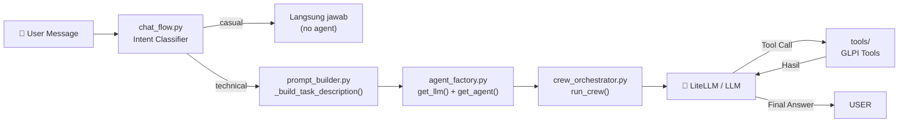
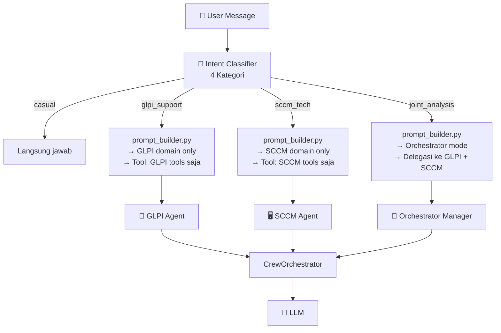
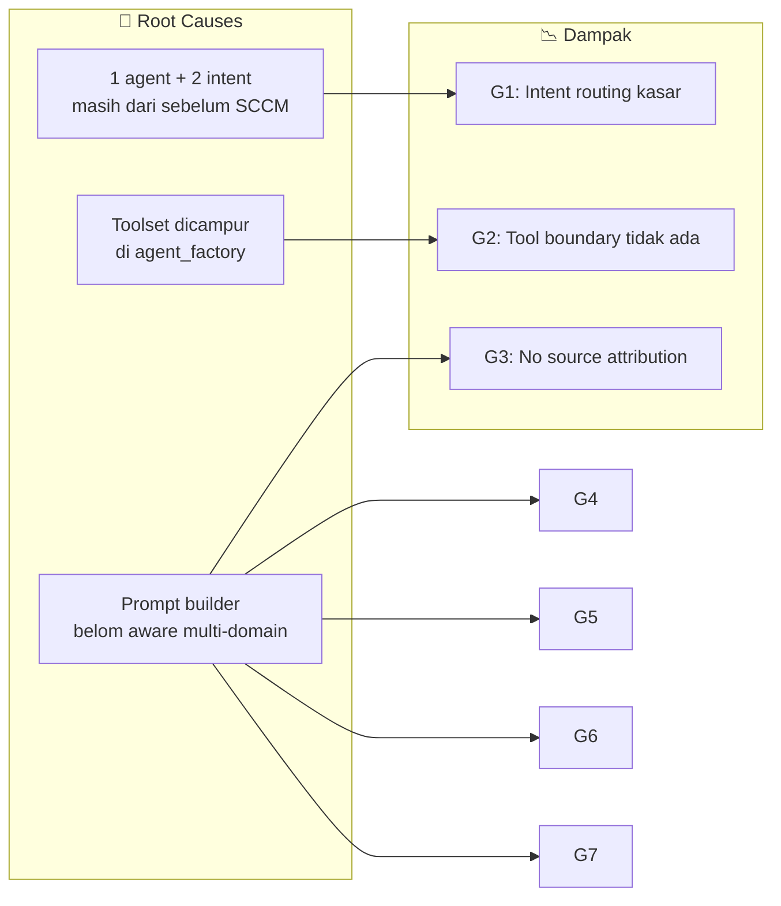
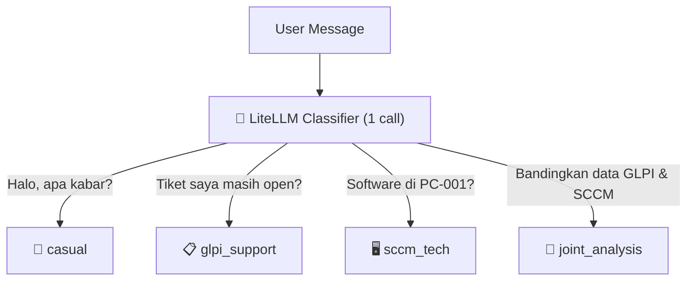
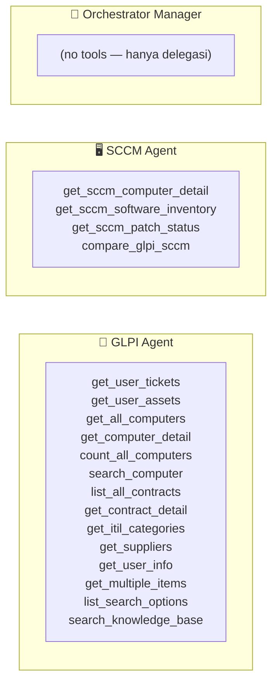
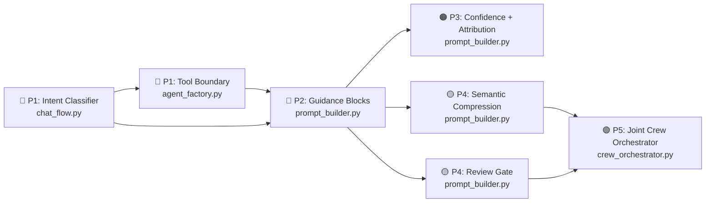

# 🧠 Prompt Builder Analysis — Maksimalkan Kinerja Multi-Agent AI

> **🗺️ Peta Navigasi:**  
> [🔍 Latar Belakang](#1-latar-belakang) · [📊 Assessment Saat Ini](#2-assessment-kondisi-saat-ini) · [🔴 5 Prinsip Krusial](#3-lima-prinsip-paling-krusial) · [🛠️ Rekomendasi Konkret](#4-rekomendasi-perubahan-konkret-per-file) · [📋 Prioritas](#5-prioritas-implementasi)

---

## 1. 🔍 Latar Belakang

| Aspek | Detail |
|---|---|
| **Apa itu Prompt Builder?** | `app/agents/prompt_builder.py` — pure function layer yang merangkai task description untuk CrewAI agents |
| **Posisi dalam Arsitektur** | Chat → Intent Router → Prompt Builder → Agent Factory → Crew Orchestrator → LLM |
| **Mengapa Krusial Sekarang?** | Integrasi SCCM menambahkan **3 agent** (GLPI + SCCM + Orchestrator) + **4 kategori intent routing** — tanpa prompt builder yang matang, multi-agent akan saling bertabrakan |
| **Referensi Terkait** | [ADR-05 (Multi-Agent)](../context.md#adr-05-multi-agent-crewai-it-support--sccm-specialist), [ADR-06 (Intent Routing)](../context.md#adr-06-intent-based-dynamic-routing-4-kategori), [PRD-04 §3.6](../PRD/PRD-04-SCCM-Connector-Data-Layer.md#36-sub-modul-f-sccm-crewai-tools) |

### 1.1 Alur Data Saat Ini



### 1.2 Alur Data Setelah SCCM (Target)



---

## 2. 📊 Assessment Kondisi Saat Ini

### 2.1 ✅ Yang Sudah Berfungsi Baik

| Aspek | Detail | File & Baris |
|---|---|---|
| **Anti-Hallusinasi** | Aturan keras: *"100% dari tool output, JANGAN menjawab dari memori"* | `prompt_builder.py` — `_LARGE_DATA_GUIDANCE` |
| **Anti-Looping** | `max_iter=8`, `max_retry_limit=2`, aturan *"Looping tool = TIMEOUT"* | `crew_orchestrator.py` + `prompt_builder.py` L268 |
| **Data Besar** | `[INSTRUKSI SISTEM]` — tool inject instruction → agent stop + Final Answer | `tools.py` + `prompt_builder.py` L262-266 |
| **History Window** | 6 turns terakhir saja, tidak membawa seluruh sesi | `prompt_builder.py` `_HISTORY_WINDOW=6` |
| **Token Budget** | `max_tokens=4096`, `_MAX_STORED_ANSWER_LEN=2000` | `agent_factory.py`, `prompt_builder.py` |
| **Pure Function** | Tidak ada I/O, HTTP, atau logging — testable & predictable | `prompt_builder.py` docstring |
| **Backstory Agent** | Identitas agent jelas: *"IT Support Specialist GLPI — data administratif aset"* | `agent_factory.py` |
| **Bahasa Indonesia** | Agent wajib menjawab dalam Bahasa Indonesia | `agent_factory.py` backstory |

### 2.2 ⚠️ Gap — Terutama dengan SCCM Multi-Agent

| # | Gap | Dampak | Kritisitas |
|---|---|---|---|
| G1 | **Intent classifier hanya 2 kategori** (`casual`/`technical`) | Routing tidak bisa membedakan pertanyaan GLPI vs SCCM → agent salah tool | 🔴 **High** |
| G2 | **Tool boundary tidak ada** — SCCM & GLPI tools akan tercampur dalam 1 agent | Agent memanggil tool milik agent lain → confusion + halusinasi | 🔴 **High** |
| G3 | **Tidak ada data source attribution** — agent tidak tahu dari mana data berasal | Jawaban mencampur aduk data GLPI (admin) & SCCM (telemetri) tanpa label | 🟠 **Medium** |
| G4 | **Tidak ada confidence signaling** — `match_confidence` (1.0/0.85/0.65) tidak disampaikan ke prompt | Agent tidak bisa menilai seberapa可信 data korelasi saat menjawab | 🟠 **Medium** |
| G5 | **History compression character-based** — potong 2000 karakter pertama polos | Informasi penting (angka, summary, error) bisa hilang | 🟡 **Medium** |
| G6 | **Tidak ada orchestrator manager prompt** — Joint Crew tidak punya cetak biru | Joint Crew tidak punya panduan cara menggabungkan output GLPI + SCCM | 🟡 **Medium** |
| G7 | **Tidak ada review gate awareness** | Agent tidak memberi tahu user bahwa hasil korelasi perlu di-approve | 🟡 **Low** |

### 2.3 Root Cause Mapping



---

## 3. 🔴 Lima Prinsip Paling Krusial

### Prinsip #1: Intent Classification yang Tepat Sebelum Prompt Dibangun

**Mengapa:** Jika klasifikasi intent salah, semua prompt setelahnya menjadi tidak optimal. Ini adalah **pintu gerbang** arsitektur multi-agent.

**Kondisi saat ini** (`chat_flow.py`):
```python
async def route_message(self, message: str) -> str:
    if self._is_casual(message):
        return "casual"
    return "technical"  # 🔴 Terlalu kasar — semua GLPI/SCCM masuk sini
```

**Kondisi target — 4 kategori:**


**Dampak jika tidak diperbaiki:** Pertanyaan SCCM masuk ke GLPI agent → agent frustasi mencari data di GLPI → hasil salah atau error.

---

### Prinsip #2: Tool Boundary yang Kaku per Agent

**Mengapa:** Ini **paling sering menjadi sumber confusion** di multi-agent. Agent yang satu mulai memanggil tool milik agent lain karena deskripsi tool yang ambigu.

**Kondisi saat ini** (`agent_factory.py`):
```python
def get_it_support_agent(llm):
    return Agent(
        role="IT Support Specialist GLPI",
        tools=[...],  # 🔴 Nanti SCCM tools juga akan ditambahkan di sini
        ...
    )
```

**Kondisi target — toolset terpisah:**


**Dampak jika tidak diperbaiki:** Chaos — agent SCCM memanggil tool GLPI, agent GLPI mencoba query SCCM, output campur aduk tanpa struktur.

---

### Prinsip #3: Data Source Attribution & Confidence Signaling

**Mengapa:** Tanpa ini, agent tidak bisa membedakan data mana yang berasal dari sumber mana — menghasilkan jawaban yang mencampur aduk data administratif (GLPI) dengan telemetri (SCCM).

**Contoh prompt block yang dibutuhkan untuk joint_analysis:**

```
[DATA DARI GLPI — Administratif]
   Kepemilikan: user, lokasi, departemen
   Tiket: status, frekuensi, kategori
   Kontrak: status warranty, vendor

[DATA DARI SCCM — Telemetri Live]
   Hardware: CPU, RAM, manufaktur, model
   Software: display name, version, publisher
   Patch: compliance %, missing count

[DATA KORELASI — Perbandingan]
   Metode match: hostname (conf 1.0) | serial (0.85) | mac (0.65)
   Status: matched ✅ | mismatch ⚠️ | missing_in_sccm 🚫 | missing_in_glpi 👻

📊 ATURAN PENYAMPAIAN KONFLIK DATA:
   Jika ada perbedaan antara GLPI dan SCCM (misal OS version):
   - JANGAN asumsi mana yang benar
   - Tampilkan KEDUA data: "GLPI mencatat X, SCCM mendeteksi Y"
   - Akhiri dengan rekomendasi: "Disarankan verifikasi dan update data di GLPI"
```

---

### Prinsip #4: Semantic Compression untuk History

**Mengapa:** Prompt yang terlalu panjang → attention dilution + token boros + response lambat.

**Kondisi saat ini:**
```python
return answer[:_MAX_STORED_ANSWER_LEN] + "\n\n[jawaban dipotong...]"  # 🔴 Character-based
```

**Kondisi target — semantic compression:**
```python
def _compress_semantically(answer: str, max_chars: int = 1000) -> str:
    """Pertahankan: angka, nama, summary, error, rekomendasi. Buang boilerplate."""
    important_lines = [
        line for line in answer.split("\n")
        if any(kw in line.lower() for kw in [
            "total", "ditemukan", "error", "rekomendasi", "⚠️", "✅",
            "match", "mismatch", "missing",
        ]) or re.search(r'\d+', line)
    ]
    return "\n".join(important_lines[:15])[:max_chars]
```

---

### Prinsip #5: Human Review Gate Awareness

**Mengapa:** Hasil korelasi SCCM punya approval gate (`pending_review` → `approved`/`rejected`). Agent harus sadar bahwa data belum final.

```python
_REVIEW_GATE_GUIDANCE = """
📋 STATUS HASIL KORELASI:
   - Status saat ini: PENDING_REVIEW (menunggu persetujuan manajemen)
   - Sampaikan ke user: "Hasil korelasi sudah tersedia dan menunggu review
     admin. Silakan hubungi manajemen untuk proses approval."
   - JANGAN menyajikan hasil korelasi seolah-olah final/sudah di-apply.
"""
```

---

## 4. 🛠️ Rekomendasi Perubahan Konkret per File

### 4.1 `app/agents/prompt_builder.py` — Perubahan Inti

| Perubahan | Detail | Prioritas |
|---|---|---|
| ✏️ **`_build_task_description()` — parameter baru** | Tambah `intent: str`, `available_domains: list[str]` | 🔴 P1 |
| 🆕 **Intent-specific guidance blocks** | `_GLPI_GUIDANCE`, `_SCCM_GUIDANCE`, `_JOINT_ANALYSIS_GUIDANCE` | 🔴 P1 |
| 🆕 **Tool boundary enforcement** | Prompt: *"Kamu HANYA bisa panggil tool berikut: [TOOL_LIST]. DILARANG panggil tool di luar daftar ini."* | 🔴 P2 |
| 🆕 **Confidence table** | Blok tabel match method + confidence untuk context | 🟠 P3 |
| ✏️ **`_compress_for_history()` → semantic version** | Ganti dari character-based ke keyword-based semantic compression | 🟡 P4 |
| 🆕 **Review gate awareness** | `_REVIEW_GATE_GUIDANCE` — disclaimer pending_review | 🟡 P4 |

#### Detail: `_build_task_description()` — Signature Baru

```python
def _build_task_description(
    user_message: str,
    glpi_user_id: int,
    all_messages: list[dict],
    intent: str = "glpi_support",                    # 🔥 BARU
    available_domains: list[str] | None = None,      # 🔥 BARU
) -> str:
```

#### Detail: Intent-Specific Guidance Blocks

```python
# 🔥 BARU — Blok guidance spesifik per intent
_GLPI_ONLY_GUIDANCE: str = """
📋 DOMAIN: GLPI SUPPORT SAJA
Tool yang BOLEH dipanggil: [GLPI tools — tiket, komputer, kontrak, supplier, KB]
Tool yang DILARANG: [SCCM tools]

Jika user bertanya tentang software terinstall, spesifikasi hardware, atau patch:
→ KATAKAN: "Data tersebut ada di sistem SCCM. Silakan bertanya ke SCCM Infrastructure Specialist."
"""

_SCCM_ONLY_GUIDANCE: str = """
🖥️ DOMAIN: SCCM TECHNICAL SAJA
Tool yang BOLEH dipanggil: [SCCM tools — hardware, software, patch, compare]
Tool yang DILARANG: [GLPI tools — tiket, kontrak, KB, supplier]

Jika user bertanya tentang tiket, kontrak, atau KB:
→ KATAKAN: "Data tersebut ada di sistem GLPI. Silakan bertanya ke IT Support Specialist GLPI."
"""

_JOINT_ANALYSIS_GUIDANCE: str = """
🔗 DOMAIN: JOINT ANALYSIS (GLPI + SCCM)

Tugas Orchestrator Manager:
1. DELEGASI pengambilan data GLPI → IT Support Specialist
2. DELEGASI pengambilan data SCCM → SCCM Infrastructure Specialist
3. GABUNGKAN hasil kedua agent menjadi narasi final

📊 TINGKAT KEPERCAYAAN DATA:
  ┌──────────────┬──────┬─────────────────────────┐
  │ Metode       │ Conf │ Keterangan               │
  ├──────────────┼──────┼─────────────────────────┤
  │ Hostname     │ 1.0  │ Full match normalisasi   │
  │ Serial       │ 0.85 │ Kuat, placeholder difilter│
  │ MAC Address  │ 0.65 │ Cukup, rentan false positif│
  └──────────────┴──────┴─────────────────────────┘

ATURAN PENYAMPAIAN HASIL:
- Jika data GLPI & SCCM berbeda → tampilkan KEDUA-NYA
- Jangan asumsi data mana yang benar
- Akhiri dengan rekomendasi tindakan
"""

_REVIEW_GATE_GUIDANCE: str = """
⏳ STATUS REVIEW:
   Hasil korelasi GLPI ↔ SCCM saat ini: PENDING_REVIEW
   Sampaikan ke user: "Hasil korelasi tersedia namun menunggu persetujuan manajemen.
   Silakan hubungi admin untuk proses approval sebelum data di-apply ke GLPI."
"""
```

### 4.2 `app/agents/agent_factory.py` — Factory dengan Toolset Terpisah

| Perubahan | Detail | Prioritas |
|---|---|---|
| ✏️ **`get_agent()` — parameter baru** | Tambah `domain: str` untuk memilih toolset | 🔴 P1 |
| 🆕 **Agent definitions terpisah** | `GLPI_AGENT_TOOLS`, `SCCM_AGENT_TOOLS` sebagai constant | 🔴 P2 |

```python
# 🔥 BARU — Toolset per domain
GLPI_AGENT_TOOLS: list[BaseTool] = [
    search_knowledge_base, get_user_assets, get_all_computers,
    get_computer_detail, count_all_computers, search_computer_by_name,
    search_computer, list_all_contracts, get_contract_detail,
    get_user_tickets, get_user_info, get_itil_categories,
    get_suppliers, get_multiple_items, list_search_options,
]

SCCM_AGENT_TOOLS: list[BaseTool] = [
    get_sccm_computer_detail, get_sccm_software_inventory,
    get_sccm_patch_status, compare_glpi_sccm,
]

def get_agent(llm, role: str, domain: str = "glpi") -> Agent:
    """Factory method — pilih toolset berdasarkan domain."""
    if domain == "sccm":
        tools = SCCM_AGENT_TOOLS
        backstory = _SCCM_AGENT_BACKSTORY
    elif domain == "orchestrator":
        tools = []  # No tools — delegasi saja
        backstory = _ORCHESTRATOR_BACKSTORY
    else:
        tools = GLPI_AGENT_TOOLS
        backstory = _GLPI_AGENT_BACKSTORY
    ...
```

### 4.3 `app/services/chat_flow.py` — Intent Router 4 Kategori

```python
async def classify_intent(self, message: str) -> str:
    """🧠 Classify intent ke 4 kategori via LiteLLM single call."""
    if self._is_casual(message):
        return "casual"
    
    response = await litellm.acompletion(
        model=settings.ai_model,
        messages=[{
            "role": "system",
            "content": """Classify user intent into ONE of:
- glpi_support: tickets, contracts, user info, knowledge base, asset ownership
- sccm_tech: software inventory, hardware specs, patch compliance, SCCM-specific
- joint_analysis: comparison of GLPI vs SCCM, cross-system reporting
- casual: greetings, small talk, thanks

Reply ONLY the category keyword: glpi_support | sccm_tech | joint_analysis | casual"""
        }, {
            "role": "user", "content": message
        }],
        max_tokens=10,
        temperature=0,
    )
    intent = response.choices[0].message.content.strip()
    return intent if intent in ("glpi_support", "sccm_tech", "joint_analysis", "casual") else "glpi_support"
```

### 4.4 `app/services/crew_orchestrator.py` — Orchestrator Manager Routing

```python
async def run_joint_crew(user_message: str, glpi_user_id: int, session_id: str) -> str:
    """Joint Crew: GLPI → SCCM → Orchestrator."""
    
    # Step 1: Kumpulkan data GLPI
    glpi_result = await run_single_agent(
        user_message=user_message,
        glpi_user_id=glpi_user_id,
        domain="glpi",
    )
    
    # Step 2: Kumpulkan data SCCM
    sccm_result = await run_single_agent(
        user_message=user_message,
        glpi_user_id=glpi_user_id,
        domain="sccm",
    )
    
    # Step 3: Orchestrator gabungkan
    combined_prompt = prompt_builder._build_task_description(
        user_message=user_message,
        glpi_user_id=glpi_user_id,
        all_messages=[],
        intent="joint_analysis",
        available_domains=["glpi", "sccm"],
    ) + f"""
    
[DATA DARI GLPI AGENT — HASIL COLLECTION]
{glpi_result}

[DATA DARI SCCM AGENT — HASIL COLLECTION]
{sccm_result}

📋 TUGAS ORCHESTRATOR:
Bandingkan data GLPI dan SCCM di atas. 
Sampaikan perbedaan yang ditemukan dan berikan rekomendasi.
"""
    
    orchestrator = get_agent(llm, role="Orchestrator Manager", domain="orchestrator")
    ...
```

### 4.5 Perubahan Non-Breaking pada `app/utils.py`

```python
# 🔥 BARU — Utility untuk sanitasi + tagging sumber data
def tag_data_source(text: str, source: str) -> str:
    """Tambahkan tag sumber data ke output tool."""
    return f"[Sumber: {source}]\n{text}"

def extract_confidence(match_method: str) -> float:
    """Mapping match method → confidence score untuk prompt."""
    return {"hostname": 1.0, "serial": 0.85, "mac": 0.65}.get(match_method, 0.0)
```

---

## 5. 📋 Prioritas Implementasi

### Peta Ketergantungan



### Tabel Prioritas

| Prioritas | Prinsip | File | Dampak |
|---|---|---|---|
| **🔴 P1** | Intent Classification 4 Kategori | `chat_flow.py` | Tanpa ini, multi-agent tidak bisa routing dengan benar |
| **🔴 P1** | Tool Boundary Kaku per Agent | `agent_factory.py` | Tanpa ini, agent saling tabrak tool |
| **🟠 P2** | Intent-Specific Guidance Blocks | `prompt_builder.py` | Dengan guidance, agent lebih fokus di domainnya |
| **🟠 P3** | Data Source Attribution + Confidence | `prompt_builder.py`, `utils.py` | Meningkatkan kredibilitas jawaban — antarmuka perbedaan GLPI/SCCM |
| **🟡 P4** | Semantic Compression | `prompt_builder.py` | Efisiensi token — semakin penting dengan data korelasi besar |
| **🟡 P4** | Review Gate Awareness | `prompt_builder.py` | Governance compliance — hasil korelasi menunggu approve |
| **🟢 P5** | Joint Crew Orchestrator | `crew_orchestrator.py` | Pipeline GLPI → SCCM → Gabung — fitur joint_analysis |

### Risiko & Mitigasi

| Risiko | Mitigasi |
|---|---|
| **Classifier overhead** — 1 extra LLM call per chat | `max_tokens=10` + `temperature=0` = minimal latency (< 500ms) |
| **Prompt token membengkak** dengan guidance blocks | Hitung total token. Jika > 4000, gunakan short form guidance saat intent=glpi/sccm murni |
| **Backward compatibility** — chat flow existing harus tetap jalan | Ubah `chat_flow.py` dengan `if/else` branching — intent classifier fallback ke `glpi_support` jika gagal |
| **SCCM belum siap** — graceful degradation | Jika SCCM offline, `sccm_tech` dan `joint_analysis` return fallback message |

---

> **📌 Dokumen ini:** Analisis teknis untuk panduan implementasi prompt builder  
> **Referensi:** `context.md` (ADR-05, ADR-06) · `plan.md` Task 6 · `spec.md` §6 · `PRD-04` §3.6
