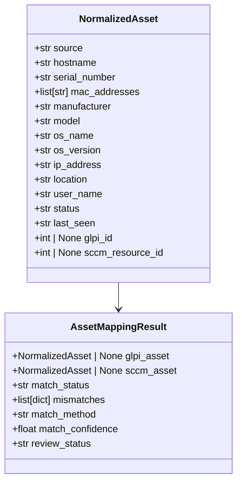
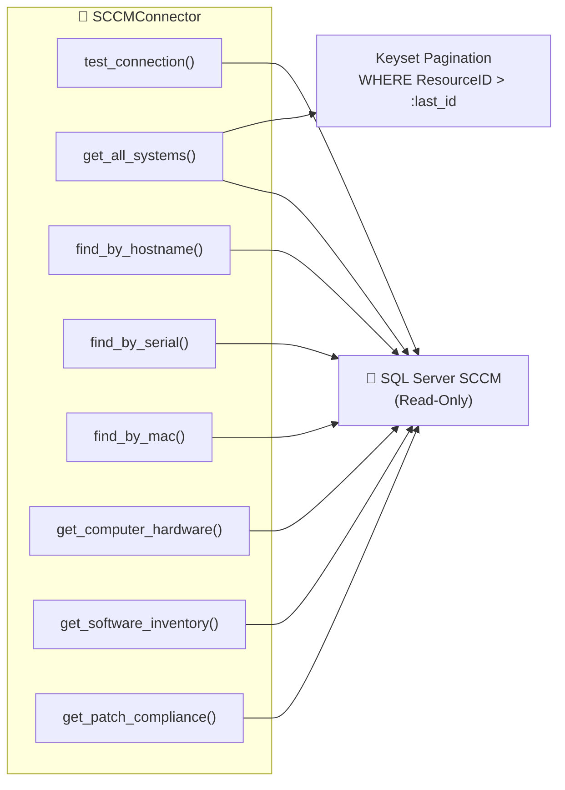
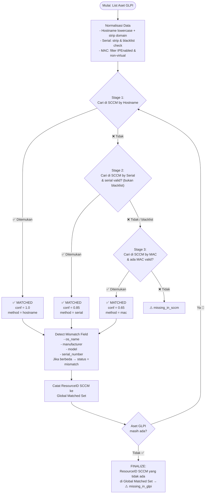
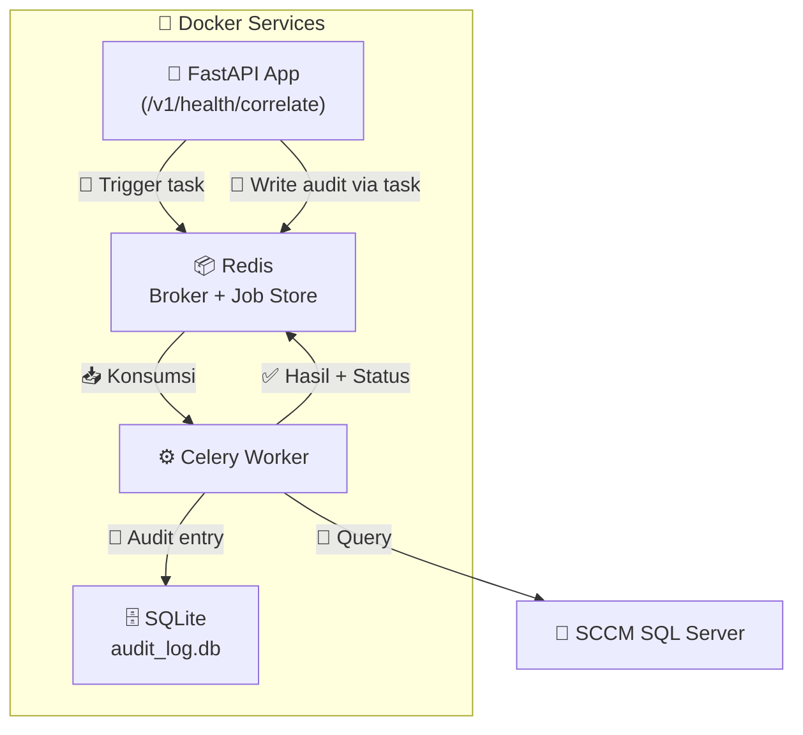
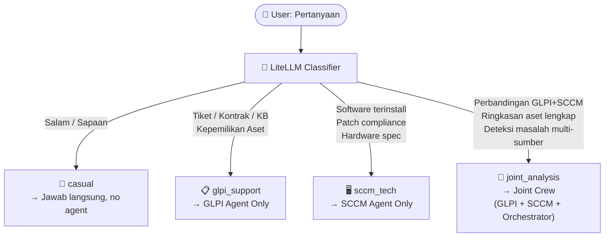

> **⛔ DOKUMEN INI TELAH DIPINDAHKAN**
>
> Dokumen perencanaan Phase 2 (SCCM Integration, Asset Health, Docker, Celery)
> telah dipindahkan ke subdirektori `docs/planned/`.
>
> **Buka di:** `docs/planned/spec.md`

---

# 📐 SPEC.md — Spesifikasi Fungsional & Teknis Integrasi SCCM

> **🗺️ Peta Navigasi:**  
> [📦 Domain Models](#1-domain-models--pydantic-schemas) · [🔌 SCCM Connector](#2-sccm-database-connector) · [🔗 Asset Correlator](#3-asset-correlation-service) · [⚙️ Celery Worker](#4-celery-worker--background-correlation) · [🌐 API Endpoints](#5-api-endpoints) · [🤖 CrewAI Agents](#6-crewai-multi-agent--dynamic-intent-routing)

---

## 1. 📦 Domain Models & Pydantic Schemas

### 1.1 Asset Mapping Models (`app/normalizers/asset_mapper.py`)



| 🏷️ Field | Tipe | Deskripsi |
|---|---|---|
| `source` | `str` | `'glpi'` \| `'sccm'` \| `'both'` |
| `match_status` | `str` | `'matched'` \| `'mismatch'` \| `'missing_in_sccm'` \| `'missing_in_glpi'` |
| `match_method` | `str` | `'hostname'` \| `'serial'` \| `'mac'` |
| `match_confidence` | `float` | `1.0` (hostname) · `0.85` (serial) · `0.65` (mac) |
| `review_status` | `str` | `'pending_review'` \| `'approved'` \| `'rejected'` |

### 1.2 Audit Log Model (`app/normalizers/audit.py`)

```python
from pydantic import BaseModel, Field
from datetime import datetime

class AuditLogEntry(BaseModel):
    """📝 Setiap baris audit = satu aksi governance (trigger/approve/reject)."""
    job_id: str                                         # ID korelasi yang di-*action*
    requester_id: str                                   # Dari header X-Requester-ID
    requester_name: str                                 # Dari header X-Requester-Name
    action: str                                         # 'trigger' | 'approve' | 'reject'
    timestamp: datetime = Field(default_factory=datetime.utcnow)
    summary_changes: dict = {}                          # {'matched': 150, 'mismatch': 12}
```

---

## 2. 🔌 SCCM Database Connector (`app/connectors/sccm_connector.py`)



### ⚙️ Konfigurasi Koneksi

| Parameter | Nilai | Deskripsi |
|---|---|---|
| **Driver** | `mssql+pymssql://` | SQLAlchemy + pymssql |
| **Pool** | `QueuePool` | Connection pooling bawaan SQLAlchemy |
| `pool_pre_ping` | `True` | Deteksi koneksi putus secara otomatis |
| `encrypt` | `true` | 🔒 Enkripsi TLS wajib |
| `trustServerCertificate` | `sccm_db_trust_server_cert` | ⚙️ Dinamis (self-signed/CA) |

### 📖 Method Reference

| Method | Signature | Return | SQL View Target |
|---|---|---|---|
| `test_connection` | `() -> dict` | `{"status": "ok", "version": "..."}` | `SELECT @@VERSION` |
| `get_all_systems` | `(last_seen_id: int, batch_size: int) -> list[dict]` | Daftar sistem aktif (paginated) | `v_R_System` (keyset pagination) |
| `find_by_hostname` | `(hostname: str) -> dict \| None` | Satu sistem hasil pencarian | `v_R_System` |
| `find_by_serial` | `(serial: str) -> dict \| None` | Satu sistem via serial BIOS | `v_GS_PC_BIOS` join `v_R_System` |
| `find_by_mac` | `(mac: str) -> dict \| None` | Satu sistem via MAC address | `v_GS_NETWORK_ADAPTER` join `v_R_System` |
| `get_computer_hardware` | `(resource_id: int) -> dict \| None` | CPU, RAM, OS, Manufaktur | `v_GS_COMPUTER_SYSTEM`, `v_GS_PROCESSOR`, `v_GS_X86_COMPUTER_SYSTEM` |
| `get_software_inventory` | `(resource_id: int) -> list[dict]` | Software terinstall | `v_GS_INSTALLED_SOFTWARE_CATEGORIZED` |
| `get_patch_compliance` | `(resource_id: int) -> dict` | `{"total": 50, "installed": 48, "missing": 2, "compliance_pct": 96.0}` | `v_Update_ComplianceStatus` |

---

## 3. 🔗 Asset Correlation Service (`app/correlators/asset_correlator.py`)

### 🎯 Algoritma Lengkap



### 🧹 Data Quality Filters

<details>
<summary><strong>Klik untuk detail filter kualitas data</strong></summary>

| Filter | Penerapan | Regex / Pattern |
|---|---|---|
| **Serial Blacklist** | Stage 2 skip jika serial ada di daftar | `To Be Filled By O.E.M.`, `System Serial Number`, `00000000`, `12345678`, `Not Specified` (case-insensitive) |
| **MAC Exclude Virtual** | Stage 3 skip adapter non-fisik | `Description0 NOT LIKE '%Virtual%' AND NOT LIKE '%VPN%' AND NOT LIKE '%TAP%' AND NOT LIKE '%Bluetooth%'` |
| **MAC Filter IP** | Hanya adapter aktif | `IPEnabled0 = 1` |
| **Stale Resolver** | Multi-match → pilih terbaru | `ORDER BY LastHWScan DESC LIMIT 1` dari `v_GS_WORKSTATION_STATUS` |
| **Aset Aktif** | Default semua query | `Obsolete0 = 0 AND Active0 = 1` |

</details>

### 📊 Confidence by Match Method

| Match Method | Confidence | Basis |
|---|---|---|
| 🏠 **Hostname** | `1.0` | Full match setelah normalisasi (lowercase, strip domain) |
| 🔢 **Serial** | `0.85` | Kuat, tapi tetap ada risiko placeholder walau sudah difilter |
| 🌐 **MAC** | `0.65` | Rentan false positive karena NIC bisa dipindah antar device |

### 🔍 Full-Outer-Join: Missing Asset Detection

Langkah setelah Stage 1–3 selesai untuk **semua** aset GLPI:

```python
# Pseudocode:
global_matched_resource_ids = set()  # Semua ResourceID SCCM yang berhasil match

for glpi_asset in all_glpi_assets:
    result = run_matching_stages(glpi_asset)
    if result.match_status == "matched":
        global_matched_resource_ids.add(result.sccm_asset.resource_id)
    else:
        result.match_status = "missing_in_sccm"  # Gagal di semua 3 stage

# Setelah iterasi GLPI selesai:
for sccm_asset in all_sccm_assets:
    if sccm_asset.resource_id NOT IN global_matched_resource_ids:
        mark_as(AssetMappingResult(match_status="missing_in_glpi", sccm_asset=sccm_asset))
```

---

## 4. ⚙️ Celery Worker & Background Correlation

### 🏗️ Arsitektur Worker



### 📦 Storage Strategy

| Store | Tujuan | Persistence | TTL |
|---|---|---|---|
| 🟢 **Redis** | Job progress, pending review results ✅ | Volume mount (`appendonly yes`) | `pending_review` = **tanpa TTL** |
| 🟢 **Redis** | Approved/rejected results | Volume mount | TTL 30 hari setelah aksi |
| 🟤 **SQLite** | Audit trail log (WAL mode) | Volume mount (`./data/audit`) | **Permanent** (backup AHM) |

### 🛡️ Guard & Idempotency

| Guard | Trigger | Response |
|---|---|---|
| 🚫 **Duplicate Job** | `POST /correlate` saat ada job `STARTED` | `409 Conflict` + `{"existing_job_id": "..."}` |
| 🔒 **Idempotency Approve** | `POST /approve` pada job bukan `pending_review` | `409 Conflict` + `{"error": "Job already approved/rejected"}` |
| 🔒 **Idempotency Reject** | `POST /reject` pada job bukan `pending_review` | `409 Conflict` + `{"error": "Job already approved/rejected"}` |

---

## 5. 🌐 API Endpoints

### 🔑 Autentikasi

| Endpoint Group | API Key | Scope |
|---|---|---|
| 💬 Chat (`/v1/chat/*`) | `GATEWAY_API_KEY` | Chat dengan AI |
| 🩺 Health + Korelasi (`/v1/health/*`) | `GLPI_PLUGIN_API_KEY` | 🔐 Khusus GLPI plugin |
| ✅ `/health` (public) | ❌ Tidak perlu | Health check dasar |

### 📋 Daftar Endpoint

<details>
<summary><strong>📌 GET /health — Status Sistem</strong></summary>

```json
{
  "status": "ok",
  "services": {
    "glpi_api": "connected",
    "glpi_db": "connected",
    "sccm_db": "connected",
    "redis": "connected"
  },
  "version": "2.3.0"
}
```
</details>

<details>
<summary><strong>📌 POST /v1/health/correlate — Trigger Korelasi</strong></summary>

**Headers:** `Authorization: Bearer <GLPI_PLUGIN_API_KEY>`, `X-Requester-ID`, `X-Requester-Name`

**Response (200 — Success):**
```json
{"job_id": "corr-abc123", "status": "started"}
```

**Response (409 — Duplicate):**
```json
{"error": "Correlation job already running", "existing_job_id": "corr-abc123"}
```
</details>

<details>
<summary><strong>📌 GET /v1/health/correlate/pending — Pending Reviews</strong></summary>

```json
{
  "jobs": [
    {
      "job_id": "corr-abc123",
      "status": "pending_review",
      "summary": {"matched": 150, "mismatch": 12, "missing_in_sccm": 3, "missing_in_glpi": 5},
      "created_at": "2026-07-22T10:00:00Z"
    }
  ]
}
```
</details>

<details>
<summary><strong>📌 POST /v1/health/correlate/{job_id}/approve — Approve Hasil</strong></summary>

**Headers:** `Authorization: Bearer <GLPI_PLUGIN_API_KEY>`, `X-Requester-ID`, `X-Requester-Name`

**Response (200):**
```json
{"job_id": "corr-abc123", "status": "approved", "approved_by": "Budi.IT", "timestamp": "..."}
```

**Response (409 — Idempotency):**
```json
{"error": "Job corr-abc123 is already 'approved'. Cannot approve again."}
```
</details>

---

## 6. 🤖 CrewAI Multi-Agent & Dynamic Intent Routing

### 🎭 Agent Definitions

| Agent | Role | Tools | Dipanggil Saat |
|---|---|---|---|
| 👤 **IT Support Specialist GLPI** | Data administratif GLPI | Tiket, Komputer, Kontrak, Supplier, KB | `glpi_support` |
| 🖥️ **SCCM Infrastructure Specialist** | Data teknis live SCCM | `get_sccm_computer_detail`, `get_sccm_software_inventory`, `get_sccm_patch_status`, `compare_glpi_sccm` | `sccm_tech` |
| 🎯 **Orchestrator Manager Agent** | Koordinator Joint Crew | (dinamis — delegasi ke kedua agen) | `joint_analysis` |

### 🧭 Intent Routing Decision Tree



---

> **📌 Status Dokumen:** ✅ Final — Siap untuk implementasi (Rev. 3 — ACC)
